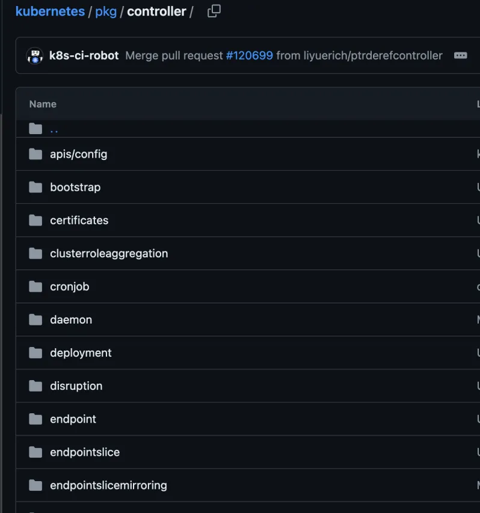

## k8s controller

- pod只是一个运行的最小单元，我们一般不会直接使用pod。基本上都是Deployment控制器、StatefulSet控制器、Daemonset控制器、Job控制器、CronJob控制器 来部署调度使用。

  

- 这些控制器通过持续监控集群状态，并采取自动化操作来维持预期状态，解决了资源调度、自愈、扩展和更新等关键问题，从而大大简化了大规模分布式系统的管理和维护。

### 什么是k8s控制器

- Kubernetes控制器是kubernetes中用于实现和维护所需状态的一类进程或功能模块。
- 每个控制器都是一个循环系统，负责不断监控和调整kubernetes集群中的资源状态，以确保这些资源达到用户期望的状态。
  - 简单来说，控制器的主要职责就是通过监控和管理kubernetes资源来实现自我修复和自动化操作。

### kubernetes 中控制器作用

- kubernetes提供了一组 **内置控制器**，用于管理核心资源并确保集群的基本功能正常运行。控制器作用如下：

  1. 状态驱动：

     - Kubernetes使用声明式管理，即用户定义所需的系统状态，而不是具体的操作步骤。

     - 控制器负责将实际状态逐步调整为用户声明的状态。

       - 例如：用户希望有三个副本的应用运行在集群中，则副本控制器（Replication Controller）

         会确保实际有且只有三个副本的运行。

  2. 持续监控

     - 控制器通过监控kubernetes API server 中的资源对象，来获取集群的当前状态。
  
       一旦检测到状态偏差，例如Pod宕机，节点故障等，控制器会立即采取行为进行恢复。
  
  3. 执行恢复操作
  
     - 控制器根据特定的业务逻辑对资源进行创建、更新或和删除操作、以恢复集群的期望状态。
     - 例如，**部署控制器（Deployment Controller）会管理 Pod 的部署和更新，确保按计划完成滚动更新和回滚操作。**
  
  4. 扩展性和灵活性
     - k8s 提供了内置控制器，例如 **Deployment、StatefulSet和 DaemonSet 等 控制器**，用户也可以根据特定需求开发自定义控制器。自定义控制器可以管理用户自定义的资源类型，满足特定业务场景的需求。
  5. 负载均衡和调度
    - 一些控制器会与调度器协同工作，确保工作负载均匀分布在集群中的各个节点上。例如，HPA（Horizontal Pod Autoscaler）控制器根据资源使用情况自动调整 Pod 副本数量，以实现负载均衡。
  6. 自动化和自愈
     - 控制器的一个关键功能是实现集群的自动化管理和自愈能力。例如，Node Controller检测到节点不可用时，会将该节点上的Pod标记为失效，并重新调度这些Pod到其他可用节点上。
  
  7. 保障高可用性
     - 控制器通过不断监控和调整资源，确保应用和服务的高可用性。可以自动处理故障和恢复任务，减少人工干预的需求。

### kubernetes常见内置控制器

- kube-controller-manager 的组件，就是一系列 内置 控制器的集合。

可以查看一下 Kubernetes 项目的pkg/controller目录 ，如下图所示：



- kubernetes提供了一系列内置控制器，用于管理集群中的各种资源和应用。
- 这些控制器负责不同类型的工作负载管理，这些 **内置控制器** 共同构成了kubernetes强大的资源管理和调度系统，确保系统的高可用性和稳定性。

- K8s有五种控制器，分别对应处理无状态应用，有状态应用，守护型应用和批处理应用。

#### Deployment 控制器

- Deployment控制器用于管理无状态应用的部署和生命周期。它支持滚动更新，回滚，扩缩容等功能。确保应用在集群中的高可用性。在Deployment 文件里可以定义Pod数量，更新方式，使用的镜像，资源限制等。

  ```
  # 指定使用的 API 组和版本
  apiVersion: extensions/v1beta1
  # 定义资源的种类
  kind: Deployment 
  # 部署资源的元数据，包括名称和其他标签信息
  metadata:
    # 部署的名字
    name: nginx-deployment
  # 部署的具体规范
  spec:
    # 设置副本数，确保任何时候都有两个 Pod 处于运行状态
    replicas: 2
    # Pod 模板，定义了 Pod 的结构
    template:
      # Pod 模板的元数据
      metadata:
        # 标签，用于选择和管理 Pod
        labels:
          app: nginx
      # Pod 的具体规范
      spec:
        # 容器列表
        containers:
        - name: nginx
          # 使用的容器镜像
          image: nginx:1.8.0
          # 容器开放的端口
          ports:
          - containerPort: 80
            # 注释说明此端口是 Nginx 监听的 HTTP 请求端口
  ```


#### StatufulSet 控制器

- StatefulSet 控制器用于管理有状态应用，确保应用实例的持久性和顺序性，例如数据库、分布式系统等。
  - 主要功能：
    - **稳点的网络标识**：每个Pod都有一个唯一的标识，在重新调度室保持不变。
    - **有序部署和更新**：Pod按照顺序创建，删除和更新，确保在特定顺序下执行操作。
    - **持久存储：**每个 Pod 都有独立的持久存储卷，确保数据持久性。

```
apiVersion: apps/v1  # 指定所使用的Kubernetes API版本
kind: StatefulSet  # 指定资源类型为StatefulSet
metadata:  # 元数据部分
  name: my-statefulset  # StatefulSet的名字
spec:  # 规范/规格定义
  serviceName: "my-service"  # 关联的服务名称，用于Pod间的网络识别
  replicas: 3  # 指定副本数量为3，即期望运行的Pod数量
  selector:  # 选择器，用于匹配属于此StatefulSet的Pod
    matchLabels:  # 匹配具有指定标签的Pod
      app: my-app
  template:  # Pod模板
    metadata:  # Pod模板的元数据
      labels:  # 给Pod打上的标签
        app: my-app
    spec:  # Pod的具体配置
      containers:  # 容器列表
      - name: my-container  # 容器的名字
        image: my-image:1.0  # 使用的Docker镜像及其版本
        volumeMounts:  # 数据卷挂载点配置
        - name: my-storage  # 引用volumeClaimTemplates中定义的数据卷名
          mountPath: /data  # 在容器内的挂载路径
  volumeClaimTemplates:  # PVC模板，用于创建持久化存储
  - metadata:  # PVC模板的元数据
      name: my-storage  # PVC的名称
    spec:  # PVC的具体要求
      accessModes: ["ReadWriteOnce"]  # 访问模式，这里指单节点读写
      resources:  # 请求的资源量
        requests:
          storage: 1Gi  # 请求1GiB的存储空间
```

#### DaemonSet控制器

- DaemonSet控制器确保每个(或指定的)节点上都运行一个Pod, 常用于日志收集、


> Deployment 和 StatefulSet 区别
>
> - 如果你的应用是无状态的，并且不需要持久化存储或者稳定的身份，那么 Deployment 可能更适合。而如果你的应用是有状态的，并且需要持久化存储以及每个实例都有一个稳定的唯一标识，则应该使用 StatefulSet。
>
> 1. **Kind**：
>    - `Deployment` 和 `StatefulSet` 都是 `Kind` 类型，但它们管理的应用类型不同。
> 2. **ServiceName**：
>    - 在 `StatefulSet` 中，`spec.serviceName` 字段是必需的，它指定了与 `StatefulSet` 相关联的 Headless Service 名称。这使得每个 Pod 都拥有一个稳定的 DNS 名称，而在 `Deployment` 中没有这个字段。
> 3. **VolumeClaimTemplates**：
>    - `StatefulSet` 中包含 `volumeClaimTemplates`，用于定义每个 Pod 需要的持久卷声明（Persistent Volume Claims, PVCs）。每个 Pod 都会有其自己的 PVC 与之对应，从而实现持久化存储。
>    - `Deployment` 不包含 `volumeClaimTemplates`，通常会单独定义 PVC 并手动与 Pod 关联。
> 4. **Pod 网络标识**：
>    - `StatefulSet` 为每个 Pod 提供了稳定的网络标识，这使得 Pod 可以通过固定的名称来访问。
>    - `Deployment` 中的 Pod 没有固定的网络标识，每个 Pod 的 IP 地址可能会随着重启而变化。
> 5. **Pod 更新策略**：
>    - `Deployment` 支持滚动更新策略，可以逐步替换 Pod，保持应用的高可用性。
>    - `StatefulSet` 也支持滚动更新，但在某些情况下可能需要按照特定顺序更新 Pod，以保持状态的一致性。
> 6. **Pod 顺序**：
>    - `StatefulSet` 中的 Pod 通常按顺序创建，并且在某些场景下需要按顺序进行操作。
>    - `Deployment` 创建 Pod 时没有特定的顺序要求。


### 自定义控制器原理

- [Kubernetes 控制器开发（详细实用） (qq.com)](https://mp.weixin.qq.com/s/9eNYvkneDSzF4xRuNM4H9Q?version=4.1.26.6018&platform=win&nwr_flag=1#wechat_redirect)

- 编写自定义控制器代码的过程分为：编写main函数、编写自定义控制器的定义、以及编写控制器里的业务逻辑三个部分。
- 


> 参考
>
> Kubernetes 控制器开发（详细实用） (qq.com)
>
> [StatefulSet和Deployment的区别 - Oops!# - 博客园 (cnblogs.com)](https://www.cnblogs.com/weifeng1463/p/10284122.html)
