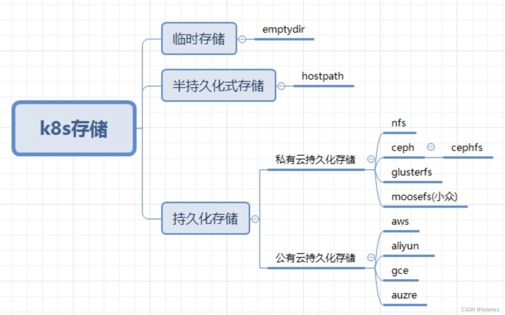

# kubernetes的存储机制

- kubernetes提供了多种存储选项来满足应用程序的持久化存储需求。

  [K8S存储总结&持久化存储解决方案（以NFS为例）-CSDN博客](https://blog.csdn.net/xueqinglalala/article/details/133702486)

## emptydir

- 当pod的存储方案设定为emptydir的时候，pod启动时，就会在pod所在节点的磁盘空间开辟出一块空卷，最开始里面是什么都没有的，pod启动后容器产生的数据会存放到那个空卷中。
- **一旦pod容器消失，节点上开辟出的这个临时卷就会随着pod的销毁而销毁**
- *一般来说emptydir的用途都是用来充当临时存储空间，例如一些不需要数据持久化的微服务，我们都可以用emptydir来当做微服务pod的存储方案**
- 例子

```
```


> 参考
>
> [k8s中的PV和PVC理解 - LiZ的博客 (boilingfrog.github.io)](https://boilingfrog.github.io/2021/07/01/k8s中的PV和PVC理解/)
>
> [存储原理 - K8S训练营 (qikqiak.com)](https://www.qikqiak.com/k8strain/storage/csi/)
>
> [K8S存储总结&持久化存储解决方案（以NFS为例）-CSDN博客](https://blog.csdn.net/xueqinglalala/article/details/133702486)
