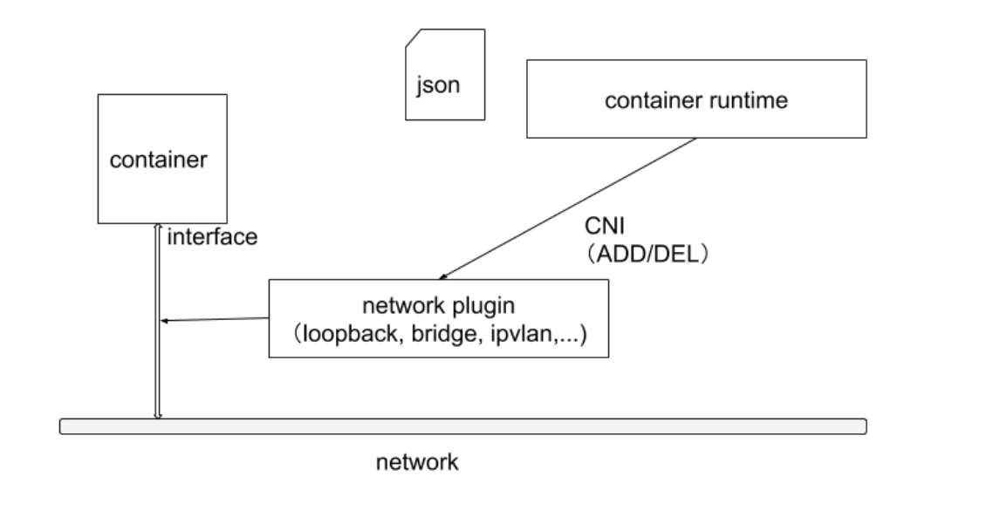
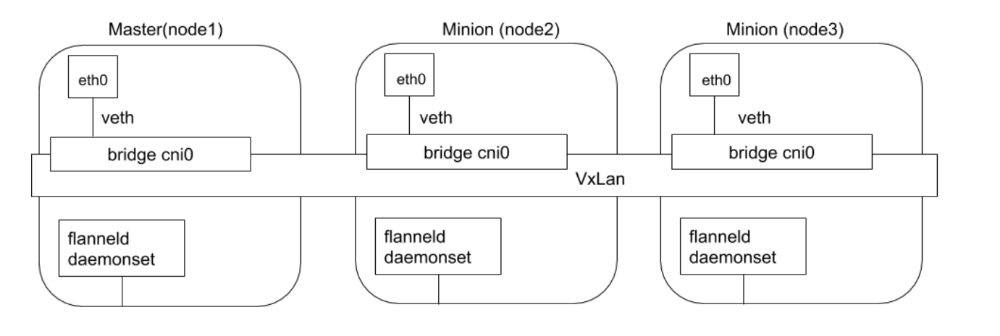
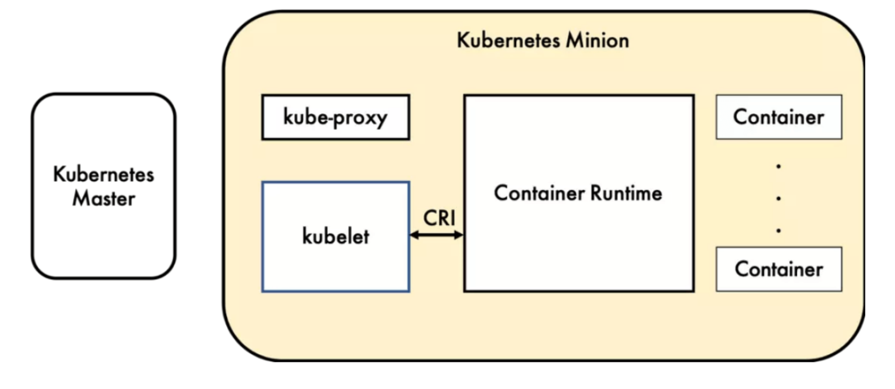
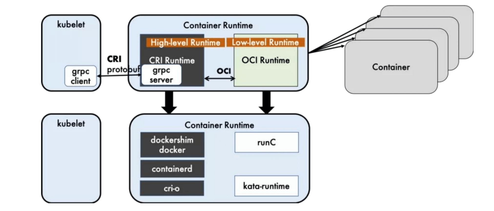
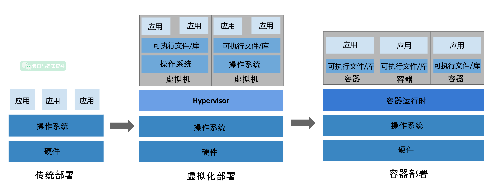
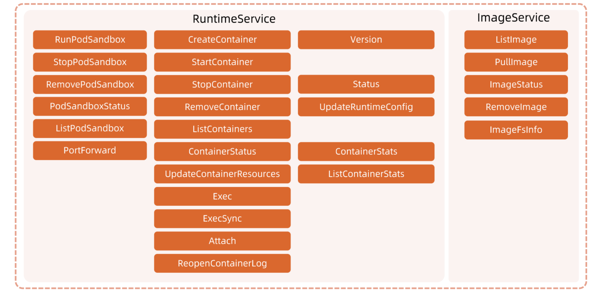
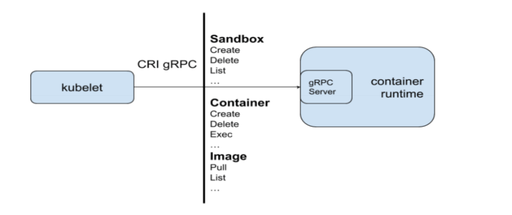

[Kubernetes 的 CNI，CRI，CSI 详解 | 熊鑫伟（cubxxw）的简体中文博客 🇨🇳 (nsddd.top)](https://nsddd.top/zh/posts/deep-dive-into-the-components-of-kubernetes-cni-csi-cri/)

[【云原生篇】深入理解K8S CNI、CRI 和 CSI_cri cni csi-CSDN博客](https://blog.csdn.net/lin819747263/article/details/137288717)

- k8s 中，CNI, CRI和CSI是三个关键的接口，分别代表Container Network Interface、Container Runtime Interface、Container Storage Interface。
- CNI, CSI,CRI, 定义了k8s 如何与网络，容器运行时和存储系统进行交互，使得kubenetes能够与各种技术栈兼容，增加了其灵活性和可扩展性。

-  **Kubernetes 的架构图（图片来自网络），其中显示了组件之间交互的接口 CNI、CRI、OCI 等，这些将 Kubernetes 与某款具体产品解耦，给用户最大的定制程度，使得 Kubernetes 有机会成为跨云的真正的云原生应用的操作系统。**


## CNI 

- 概念：CNI 是一个标准，用于定义容器应如何在网络层面进行交互和通信。它指定了一系列网络配置和接口，容器运行时可以通过这些接口为容器配置网络。
- 作用：CNI 使得 Kubernetes 可以无缝集成各种网络解决方案，包括但不限于 Weave, Calico, Flannel, Cilium 等。这些网络解决方案可以提供 Pod 网络、服务发现、负载均衡等功能。
- 原理：当 Pod 被创建或删除时，Kubernetes 调用配置的 CNI 插件来分配或回收网络资源，如 IP 地址。CNI 插件负责设置 Pod 的网络命名空间、创建网络接口和设置路由规则等。

### 命名空间

- Linux名称空间包含了大多数现代容器实现背后的一些基本技术。在高级别上，它们允许在独立进程之间隔离全局系统资源。**例如，PID命名空间隔离进程ID号空间。这意味着在同一主机上运行的两个进程可以有相同的PID！**

- 这种级别的隔离在容器世界中显然是有用的。例如，如果没有名称空间，在容器A中运行的进程*可能*会在容器B中卸载一个重要的文件系统，或者更改容器C的主机名，或者从容器D中删除一个网络接口。通过命名这些资源，容器A中的进程甚至不知道容器B、C和D中的进程存在。


### kubernetes 网络模型设计的基础原则是：

- 所有的pod能够不通过NAT就能互相访问
- 所有的节点能够不通过NAT就能相互访问
- 容器内看见的IP地址和外部组件看到的容器IP是一样的。

> kubernetes的集群里，IP地址是以Pod为单位进行分配的，每个Pod都拥有一个独立的IP地址，一个Pod内部的所有容器共享一个网络栈，即宿主机上的一个网络命名空间，包括它们的IP地址、网络设备、配置等都是共享的。
>
> Pod里面的所有容器能通过`localhost:port`来连接对方
>
> 在kubernetes中，提供了一个轻量的通用网络接口CNI（Container Network Interface），专门用于设置和删除容器的网络连通性。容器运行时通过CNI调用网络插件来完成容器的网络设置。


### CNI插件分类和常见插件

- IPAM: IP地址分配

- 主插件：网卡设置

  - bridge: 创建一个网桥，并把主机端口和容器端口插入网桥。
  - ipvlan: 为容器添加ipvlan网口
  - loopback：设置loopback网口

- Meta: 附加功能

  - portmap：设置主机端口和容器端口映射
  - bandwidth: 利用linux Traffic Control限流
  - firewall: 通过iptables或者firewalld为容器设置防火墙规则

  https://github.com/containernetworking/plugins

### CNI插件运行机制

- 容器运行时在启动时会从CNI的配置目录中读取JSON格式的配置文件。

```
cat /etc/cni/net.d # 读取这个 CNI 配置文件

ls -al /opt/cni/bin # CNI 可执行二进制文件
```

- 文件后缀为 `.conf`、`.conflist`、`.json`. 如果配置目录中包含多个文件，一般情况下，会以名字排序选用第一个配置文件作为默认的网络配置，并加载获取其中指定的CNI插件名称和配置参数。
  - 我们可以看到有个.conflist结尾的文件，是的，k8s的cni允许同时使用多个插件，并且会把上一个插件的执行结果作为参数传递给下一个插件，以此我们可以串通多个插件，让多个插件做不同的事情。比如我可以第一个插件只负责让同一台主机上的节点通信，然后第二个插件可以负责让不同节点上的pod通信。
- 关于容器网络管理，容器运行时一般需要配置两个参数`-cni-bin-dir`和`-cni-conf-dir`
  - cni-bin-dir: 网络插件的可执行文件所在目录，默认是/opt/cni/bin
  - cni-conf-dir:网络插件的配置文件所在目录，默认是/etc/cni/net.d



#### 调用过程

- 首先Pod是由kubelet来起的，然后kubelet通过CRI接口来起pod。
- 起pod的过程中又包含网络相关配置，这部分就要由CRI调用CNI实现了。
- 整个过程就是kubelet-CRI-cni

### CNI部署

- CNI 插件部署的时候一般会启动一个 DaemonSet，然后把 镜像里的二进制文件复制到宿主机的 `/opt/cni/bin` 目录下，这样就算是完成了部署。

  > 因此写一个 CNI 插件实际就是提供一些包含对应功能的二进制文件给 kubelet 调用。

  CNI 可以 设置多个，只不过 CNI 是按照顺序执行~

### CNI插件设计考量

- 容器运行时必须在调用任何插件之前为容器创建个新的网络命名空间
- 容器运行时必须决定这个容器属于哪些网络，针对每个网络，哪些插件必须要执行。
- 容器运行时必须加载配置文件，并确定设置网络时哪些插件必须被执行
- 网络配置采用json格式，可以很容易地存储在文件中
- 容器运行时必须按顺序执行配置文件里相应的插件
- 在完成容器生命周期后，容器运行时必须按照与执行添加容器相反的顺序执行插件，以便将容器与网络断开连接。
- 容器运行时被统一容器调用时不能并行操作但被不同的容器调用时，允许并行操作。
- 容器运行时被统一容器调用时不能并行操作但被不同容器调用时，允许并行操作。

- 容器运行时针对一个容器必须要按顺序执行ADD和DEL操作，ADD后面总是跟着相应的DEL。DEL可能跟着额外的DEL插件应该允许处理多个DEL。
- 容器必须由ContainerID来唯一标识，需要存储状态插件需要使用网络名称容器ID和网络接口组成的主key用于索引。
- 容器运行时针对同一个网络，同一个容器，同一个网络接口，不能连续调用两次ADD命令。

### CNI Plugin

- containerNetworking 组维护了一些CNI插件，包括网络接口创建的bridge, ipvlan, loopback, macvlan, ptp, host-devcie等， IP地址分配的DHCP，host-local和static，其他的Flannel, tunning, portmap, firewall等。

#### Flannel 

- Flannel 是由CoreOS开发的项目，是CNI插件早期的入门产品，简单易用。Flannel使用kubernetes集群的现有etcd集群来存储其状态信息，从而不必提供专用的数据存储，只需要在每个节点允许flanneld的守护进程。
- 每个节点都被分配一个子网，为该节点上的Pod分配IP地址。同一主机内Pod可以使用网桥进行通信，而不同主机上的Pod将通过flanneld将其流量封装在UDP数据包中，以路由到适当的目的地。封装方式默认和推荐方法是 **使用VxLAN**， 因为它具有良好的性能，并且比其他选项要少些人为干预。虽然使用Vxlan之类的技术封装的解决方案效果很好，但缺点就是该过程使得流量跟踪变得困难。

- 同时 Flannel 不支持 network policy。

  

#### Calico

- Calico 以其性能，灵活性和网络策略而闻名，不仅涉及在主机和Pod之间提供网络连接，而且还涉及网络安全和策略管理。

- **对于同网段通信，基于第三层，Calico使用BGP路由协议在主机之间路由数据包，使用BGP路由协议也意味着数据包在主机之间移动时 不需要包装在 额外的封装层中。** 路由器都知道pod的ip路由
- 对于跨网段通信，基于IPinIP使用虚拟机网卡设备tunlo,用一个IP数据包封装另一个IP数据包，外层 IP 数据包头的源地址为隧道入口设备的 IP 地址，目标地址为隧道出口设备的 IP 地址。

#### Calico 运行流程

插件部署后会启动 DaemonSet，该 DaemonSet 会把存放配置文件(`/etc/cni/net.d`)和二进制文件(`/opt/cni/bin`)的目录挂载到 Pod 里去，后把镜像里的配置文件和二进制文件复制到对应目录。

> DaemonSet 会运行再所有节点上，所以添加或者删除节点时都可以处理。


## CRI

- 概念：CRI 是 Kubernetes 用来与容器运行时进行交互的标准接口。它定义了一套 RPC（远程过程调用）API，这些 API 被用来管理容器的生命周期。
- 作用：CRI 使得 Kubernetes 能够支持多种容器运行时，如 Docker, containerd, CRI-O 等。这提高了系统的灵活性，允许用户根据自己的需要选择合适的容器运行时。**容器运行时(Container Runtime)，运行于Kubernetes (k8s)集群的每个节点中，负责容器的整 个生命周期。**
- 原理：Kubelet 通过 CRI 与容器运行时进行通信，包括容器的启动、停止、状态查询等操作。CRI 将这些操作转换成容器运行时能够理解的命令和调用。



### 什么是CRI

- CRI是kubernetes定义的一组gRPC服务

- kubelet 作为客户端，基于gRPC框架，通过Socket和容器运行时通信。

- 它包含两类服务：

  - 镜像服务（image service）: 提供下载，检查和删除镜像的远程程序调用

  - 运行时服务（Runtime Service）:包含用于管理容器生命周期，以及与容器交互的调用（exec/attach/port-forward）的远程程序调用。

    

    

### 什么是容器运行时

- 容器运行时（Container Runtime）是指管理容器的一类软件组件，它提供了一种隔离和管理应用程序的环境，使用应用程序可以在独立的环境中运行，而不会相互干扰。除资源隔离外，容器运行时还会负责处理容器的创建，启动，停止和销毁等生命周期管理任务，以及与宿主操作系统和底层硬件的交互。



- 容器的运行时（runtime）就是运行和管理容器进程、镜像的工具。

### 运行时的层级

- 容器运行时可分为高层和底层的运行时：
  - Dockershime, containerd和CRI-O都是遵循CRI的容器运行时，我们称之为 高级运行时。
  - OCI 定义了创建容器的格式和运行时的开源行业标准，包括 镜像规范（Image Specification) 和 容器运行时规范 （runtime specification）
    - 镜像规范定义了 OCI 镜像标准，高层级运行时 将会下载一个 OCI 镜像，并且将它解压为 OCI 运行时文件系统包（file system bundle）
    - 运行时规范描述了如何从 OCI 运行时文件系统包运行容器程序。并且定义它的配置，运行环境和生命周期。如何为新的容器设置命名空间（namespace）和控制组（cgroup) ，以及挂载根文件系统（rootfs）等等操作，都是在这里定义的。它的一个参考实现是 runc，我们称其为 **低层级运行时（Low-level Runtime)**

- **高层级运行时(High-level Runtime)**：主要包括 Docker,containerd 和 CRI-O
- **低层级运行时(Low-level Runtime)**：包含了 **runc**, kata,以及 gVisor。
  - 低层运行时 kata 和 gVisor 都还处于小规模落地或者实验阶段，其生态成熟度和使用案例都比较欠缺，所以除非有特殊的需求，否则 runc 几乎是必然的选择。因此在对容器运行时的选择上，主要是聚焦于上层运行时的选择。
  - **runc**，是对于OCI标准的一个参考实现，是一个可以用于创建和运行容器的CLI(command-line interface)工具。runc直接与容器所依赖的cgroup/linux kernel等进行交互，负责为容器配置cgroup/namespace等启动容器所需的环境，创建启动容器的相关进程。**runc也是docker、containerd内部实现容器管理的工具。**
  - 高级容器运行时将容器运行的实现交给了runc。

- https://github.com/google/gvisor

> **可能你还是无法理解，简单来说，就是一边链接 Kubernetes ，一边链接容器进程，前者是高级运行时，后者是低级运行时。**
>
> 低级容器运行时可以通过OCI规范与高级容器运行时（如containerd）进行交互。高级容器运行时会提供一个config.json文件给低级运行时，然后由低级运行时创建容器。


### OCI

- OCI（Open Container Initiative,开发容器计划）定义了创建容器的格式和运行时的开源行业标准：

  - **镜像规范（Image Specification）**: 定义了OCI镜像的标准。高层级运行时将会下载一个OCI镜像。并把它解压成OCI运行时文件系统包（filesystem bundle）。
  - **运行时规范（Runtime Specification）**: 描述了如何从OCI运行时文件包运行容器程序，并且定义它的配置，运行环境和生命周期，如何为新容器设置命名空间（namespaces）和控制组（cgroups）,以及挂载根文件系统等等操作。

- CRI 方法列表

  



- #### Docker & Containerd

  Docker 内部关于容器运行时功能的核心组件是 containerd,后来 containerd 也可直接和 kubelet 通过 CRI 对接，独立在 Kubernetes 中使用。

  > 这就是很微妙的，containerd 也提供了 CLI 工具：
  >
  > ```bash
  > crictl pods #也能读取pod信息
  > ```

  相对于 Docker而言，containerd 减少了Docker 所需的处理模块 Dockerd 和 Docker-shim,并且对 Docker 支持的存储驱动进行了优化，因此在容器的创建启动停止和删除，以及对镜像的拉取上，都具有性能上的优势。架构的简化同时也带来了维护的便利。

  当然 Docker 也具有很多 containerd 不具有的功能，例如支持 zfs 存储驱动，支持对日志的大小和文件限制，在以 overlayfs2 做存储驱动的情况下，可以通过 xfs_quota 来对容器的可写层进行大小限制等。尽管如此，containerd 目前也基本上能够满足容器的众多管理需求，所以将它作为运行时的也越来越多。

  #### docker 和 containerd 的差异细节

  可以看到 docker 中有许多 k8s 不需要的功能，k8s 需要的只是 红框中的部分，其他的都是冗余，即便去掉这部分，剩下的调用链也是非常的长。

  相比之下 containerd 整个代码和调用链都远优于 docker 的。


## CSI

- 概念：CSI 是一个标准接口，用于将外部存储系统（如云提供商的存储服务或本地存储系统）连接到 Kubernetes 中。它定义了一套标准的 API，用于容器和存储系统之间的交互。
- 作用：通过 CSI，Kubernetes 用户可以使用各种存储解决方案，而无需等待 Kubernetes 本身去集成这些解决方案。这大大加快了新存储技术的采用速度，并使得存储解决方案的提供者能够更快地向市场推出他们的产品。
- 原理：当 Kubernetes 需要挂载存储卷到 Pod 上时，它会调用 CSI 插件来创建、配置和挂载卷。同样地，当卷不再需要时，CSI 插件会负责卸载卷并执行必要的清理工作。

### 什么是CSI

- K8S CSI(container Storage interface)是针对容器化环境设计的存储接口，用于将持久化存储系统集成到kubernetes集群中。该接口的目的是提高存储系统的可插拔性和可移植性，同时简化了存储系统的管理。
- kubernetes支持以插件的形式来实现对不同存储的支持和扩展，这些扩展基于如下三种方式：
  - FlexVolume
  - in-tree volume plugins
  - CSI
- 其中CSI是一种标准化的存储接口，允许kuberntes与各种存储后端交互。CSI提高了存储系统的可插拔性和可移植性，并简化了存储系统的管理。

### CSI插件

- CSI驱动程序是CSI接口与存储后端之间的桥梁，它们允许kubernetes与各种存储后端（如本地存储，网络存储，云存储）交互，并且可以以插件方式以插件方式加载和卸载。
- 在设计 CSI 的时候，**Kubernetes 对 CSI 存储驱动的打包和部署要求很少，主要定义了 Kubernetes 的两个相关 模块：**
  - kube-controller-manager :
    - kube-controller-manager 模块用于感知 CSI 驱动存在。
    - Kubernetes 的主控模块通过 Unix domain socket (而不是 CSI 驱动)或者其他方式进行直接地交互。
    - Kubernetes 的主控模块只与 Kubernetes 相关的 API 进行交互，因此 CSI 驱动若有依赖于 Kubernetes API 的操作，例如卷的创建 、卷的 attach、 卷的快照等，需要在 CSI 驱动里面通过 Kubernetes 的 API，来触发相关的 CSI 操作。
  - kubelet:
    - kubelet 模块用于与 CSI 驱动进行交互。
    - kubelet 通过 Unix domain socket 向CSI 驱动发起 CSI 调用(如 NodeStageVolume、NodePublishkubelet通过插件注册机制发现CSI驱动及用于和CSI驱动交互的Unix Domain Socket。Volume等)，再发起 mount 卷和 umount 卷。
    - kubelet 通过插件注册机制发现 CSI 驱动及用于和 CSI 驱动交互的 Unix Domain Socket。
    - 所有部署在 Kubernetes 集群中的 CSI 驱动都要通过 kubelet 的插件注册机制来注册自己。


###  StorageClass、Persistent Volume Claim (PVC) 和 Persistent Volume (PV) 之间的关系

#### 比喻成租房

假设你是一个租客，想要租一间房子。这里有几个关键角色：

1. **StorageClass（房东的房源类型）**：
   - **定义**：房东有不同的房源类型，比如普通公寓、豪华公寓、别墅等。每种房源类型都有自己的特点，比如租金、设施等。
   - **作用**：告诉租客有哪些类型的房源可以选择。

2. **Persistent Volume Claim (PVC)（租客的租房申请）**：
   - **定义**：租客向房东提出租房申请，说明自己需要什么样的房子，比如面积、价格、房型等。
   - **作用**：告诉房东你具体需要什么样的房子。

3. **Persistent Volume (PV)（具体的房源）**：
   - **定义**：具体的房源，比如某栋楼的某个房间。这些房源可以是房东已经准备好的，也可以是根据租客的申请新建的。
   - **作用**：实际的房子，租客可以入住。

#### 使用流程

1. **定义 StorageClass**：
   
   - 房东（集群管理员）定义了几种房源类型，比如普通公寓、豪华公寓等。每种房源类型都有自己的特点，比如租金、设施等。
   - 例如，定义一个普通公寓的房源类型：
     ```yaml
     apiVersion: storage.k8s.io/v1
     kind: StorageClass
     metadata:
       name: standard
     provisioner: kubernetes.io/aws-ebs
     parameters:
       type: gp2
     ```
   
2. **创建 PVC**：
   - 租客（用户）提出租房申请，说明需要什么样的房子，比如面积、价格、房型等。
   - 例如，租客申请一个 10 平米的普通公寓：
     ```yaml
     apiVersion: v1
     kind: PersistentVolumeClaim
     metadata:
       name: my-pvc
     spec:
       accessModes:
         - ReadWriteOnce
       storageClassName: standard
       resources:
         requests:
           storage: 10Gi
     ```

3. **创建 PV**：
   - 如果房源已经准备好，房东可以直接提供。
   - 如果房源没有准备好，房东会根据租客的申请新建一个符合要求的房源。
   - 例如，房东根据租客的申请新建一个 10 平米的普通公寓：
     ```yaml
     apiVersion: v1
     kind: PersistentVolume
     metadata:
       name: my-pv
     spec:
       capacity:
         storage: 10Gi
       accessModes:
         - ReadWriteOnce
       storageClassName: standard
       awsElasticBlockStore:
         volumeID: "<volume-id>"
         fsType: ext4
     ```

4. **绑定 PVC 和 PV**：
   - 租客的申请（PVC）会被自动匹配到一个合适的房源（PV）。
   - 一旦匹配成功，租客就可以入住这个房子。

5. **Pod 使用存储**：
   - 租客（Pod）入住房子（使用 PV）。
   - 例如，租客入住并使用房子：
     ```yaml
     apiVersion: v1
     kind: Pod
     metadata:
       name: my-pod
     spec:
       containers:
         - name: my-container
           image: nginx
           volumeMounts:
             - mountPath: "/data"
               name: my-volume
       volumes:
         - name: my-volume
           persistentVolumeClaim:
             claimName: my-pvc
     ```

#### 总结

- **StorageClass** 像是房东提供的房源类型，告诉租客有哪些选择。
- **PVC** 是租客的具体租房申请，告诉房东需要什么样的房子。
- **PV** 是具体的房源，租客可以入住。

这样，Kubernetes 的存储管理就像租房一样，既灵活又自动化，确保了存储资源的有效利用和应用的顺利运行。
