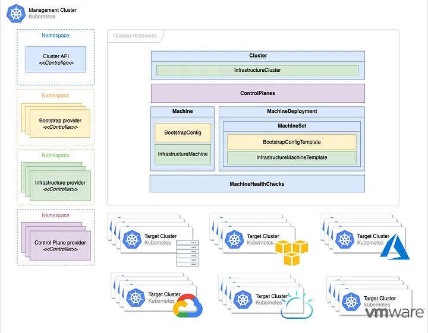
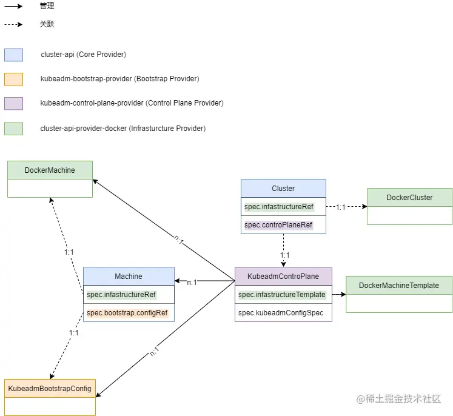
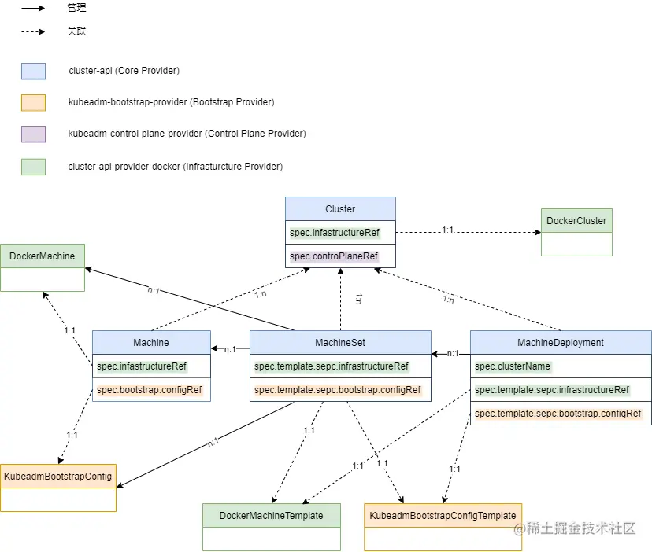

## Cluster API概念与架构




- Cluster API是kubernetes的子计划，透过一个K8s来管理多个k8s子集，包含部署，升级，节点数目的控制。
- Cluster API 是一个 Kubernetes 子项目，专注于提供声明性 API 和工具，以简化多个 Kubernetes 集群的配置、升级和操作。
- Cluster API 使用 Kubernetes 风格的 API 和模式为平台运营商自动化集群生命周期管理。支持基础设施（如虚拟机、网络、负载均衡器和 VPC）以及 Kubernetes 集群的定义方式都与部署和管理其工作负载的方式相同。这样可以在各种基础架构环境中实现一致且可重复的集群部署。

### 组件

- Managerment Cluster
  - Cluster API工作的集群，该集群一般通过kind等工具生成，在该集群上运行着一个或多个基础设施提供程序，并保存着Cluster API相关的CRD资源。是负责管理工作集群声明周期的集群。
  
- Target Cluster
  - 工作集群，由管理集群创建并管理其生命周期。
- Infrastructure provider
  - 基础设施提供商，工作集群基础设施的实际提供者（AWS, AZure和Goole等），由各大厂实现，但需要遵循Cluster API的规范去实现相应的接口和逻辑。
- Control plane provider
  - 控制平面提供者，负责Target Cluster控制平面的节点生成，Cluster API默认使用kubeadm 引导控制平面引导程序。
- Bootstrap Provider
  - 引导程序提供者，负责集群证书的生成，初始化控制平面，并控制其他节点（控制平面和工作节点）加入集群。Cluster API默认使用基于kubeadm 的引导程序。对于不同厂商可实现适配自己的节点引导程序。
- Custom Resources 
  - 自定义资源，Cluster API提供并依赖于几个自定义资源：Machine, MachineDeployment, MachineSet, Cluster.

## Cluster API资源介绍

- `kubeadm-control-plane-provider`（Control plane provider）、`kubeadm-bootstrap-provider`（bootstrap-provider）以及`cluster-api-provider-docker`（Infrastructure Provider）组件，资源版本 v1beta1 为例，梳理一下 Cluster API 的自定义资源关系图。
- 在Cluster API中对于工作集群的控制平面节点和工作节点的控制是独立分开的，由此对应的资源关系可划分为控制平面节点机器关系和工作节点机器关系。

### 控制平面节点机器关系图

- 对于`kubeadm-control-plane-provider`，工作集群控制平面节点由`KubeadmControlplane`资源控制。该资源直接控制了一组`Machine`资源，每一个`Machine`资源又分别关联了一个`DockerMachine`和`KubeadmBootstrapConfig`资源。对于使用者来说实际工作集群中的一个控制平面节点都在管理集群中以一个`Machine`资源的形式存在，`KubeadmControlplane`则是整个工作集群控制平面节点的体现。即每个实际的控制平面节点及其对应的引导配置都在管理集群中以资源的形式存在，管理集群通过控制这些资源，最终由基础设施提供者（如 cluster-api-provider-docker）作用到实际的节点或基础设施之上。

  

### 工作节点机器关系图

- 相比如控制平面节点机器的关系图，工作节点机器的关系图更为复杂，这是因为Cluster API对应工作节点机器的使用了类似于Kubenetes中Deployment的MacheDeployment, 

- 由`MachineDeployment`管理一组`MachineSet`，再由`MachineSet`管理一组`Machine`。和控制平面节点机器关系中所述一致，每个实际的控工作节点及其对应的引导配置都在管理集群中以资源的形式存在，管理集群通过控制这些资源，最终由基础设施提供者（如 cluster-api-provider-docker）作用到实际的节点或基础设施之上。

  

## 使用，以kubevirt 为例

### 安装clusterctl

- 下载cluster 二进制文件

  ```
  curl -L https://github.com/kubernetes-sigs/cluster-api/releases/download/v1.8.3/clusterctl-linux-amd64 -o clusterctl
  ```

- 安装clusterctl

  ```
  sudo install -o root -g root -m 0755 clusterctl /usr/local/bin/clusterctl
  ```

- 确认版本

  ```
  clusterctl version
  ```

### 更换版本，导入离线镜像包 （TODO）


### 初始化管理集群

#### 安装MetalLB进行负载均衡

```
METALLB_VER=$(curl "https://api.github.com/repos/metallb/metallb/releases/latest" | jq -r ".tag_name")
kubectl apply -f "https://raw.githubusercontent.com/metallb/metallb/${METALLB_VER}/config/manifests/metallb-native.yaml"
kubectl wait pods -n metallb-system -l app=metallb,component=controller --for=condition=Ready --timeout=10m
kubectl wait pods -n metallb-system -l app=metallb,component=speaker --for=condition=Ready --timeout=2m
```

#### 使用 Kubernetes API

另一种方法是直接通过 Kubernetes API 来获取节点的网络信息。例如，您可以查看节点的子网信息：

```bash
# 获取第一个节点的子网信息
NODE_SUBNET=$(kubectl get nodes -o jsonpath='{.items[0].spec.podCIDR}')

# 提取前两段 IP 地址
NET_IP=$(echo $NODE_SUBNET | cut -d'.' -f1-2)
```

#### 修改 MetalLB 配置
一旦您获得了 `NET_IP`，接下来的步骤与之前相同：

```bash
cat <<EOF | sed -E "s|172.19|${NET_IP}|g" | kubectl apply -f -
apiVersion: metallb.io/v1beta1
kind: IPAddressPool
metadata:
  name: capi-ip-pool
  namespace: metallb-system
spec:
  addresses:
  - 172.19.255.200-172.19.255.250
---
apiVersion: metallb.io/v1beta1
kind: L2Advertisement
metadata:
  name: empty
  namespace: metallb-system
EOF
```

- 然后就可以根据 `containerd` 环境下的实际网络配置来设置 MetalLB 的 IP 地址池了。请根据实际情况调整脚本中的细节。


#### 使用 KubeVirt Provider 初始化管理集群

```
clusterctl init --infrastructure kubevirt
```

#### 初始化环境变量

```
export CAPK_GUEST_K8S_VERSION="v1.29.1"
export CRI_PATH="/var/run/containerd/containerd.sock"
export NODE_VM_IMAGE_TEMPLATE="quay.io/ubuntu-2204-server-cloudimg:v1.7"
```

#### 生成集群配置

```
clusterctl generate cluster capi-quickstart \
  --infrastructure="kubevirt" \
  --flavor lb \
  --kubernetes-version ${CAPK_GUEST_K8S_VERSION} \
  --control-plane-machine-count=1 \
  --worker-machine-count=1 \
  > capi-quickstart.yaml
```

#### 应用工作负载集群

```
kubectl apply -f capi-quickstart.yaml
```

#### 配置集群网络CNI

- [使用 ClusterResourceSet 为 Cluster API 集群自动安装 CNI 插件_clusterapi环境安装-CSDN博客](https://blog.csdn.net/cr7258/article/details/128479728)
- [使用 ClusterResourceSet 为 Cluster API 集群自动安装 CNI 插件-腾讯云开发者社区-腾讯云 (tencent.com)](https://cloud.tencent.com/developer/article/2226565)


#### 访问工作集群

集群现在将开始预置。您可以使用以下方法检查状态：

```bash
kubectl get cluster
```

您还可以通过运行以下命令来获得集群及其资源的“概览”视图：

```bash
clusterctl describe cluster capi-quickstart
```

并看到类似于以下内容的输出：

```bash
NAME              PHASE         AGE   VERSION
capi-quickstart   Provisioned   8s    v1.31.0
```

要验证第一个 control plane 是否已启动：

```bash
kubectl get kubeadmcontrolplane
```

您应该会看到一个类似于以下内容的输出：

```bash
NAME                    CLUSTER           INITIALIZED   API SERVER AVAILABLE   REPLICAS   READY   UPDATED   UNAVAILABLE   AGE    VERSION
capi-quickstart-g2trk   capi-quickstart   true                                 3                  3         3             4m7s   v1.31.0
```


## 查看子集群的pod 状态

```
# 生成配置
clusterctl get kubeconfig capi-test > capi-test.kubeconfig
# 远程查看
kubectl --kubeconfig=./capi-test.kubeconfig get pod -n kube-system
# 删除集群
kubectl delete cluster capi-test
```

[快速入门 - Cluster API 手册 (k8s.io)](https://cluster-api.sigs.k8s.io/user/quick-start)

**[Kubernetes Cluster API(OpenStack)_kubernetes_panbuhei-Cloudpods (csdn.net)](https://cloudpods.csdn.net/65781101b8e5f01e1e449871.html)**

[Cluster-API的使用方法总结-琼杰笔记 (zhangqiongjie.com)](https://www.zhangqiongjie.com/5417.html)

[想要优化 K8S 集群管理？Cluster API 帮你忙 | K8S Internals 系列第 5 期K8S Int - 掘金 (juejin.cn)](https://juejin.cn/post/7147940612958847012)

[体验 Kubernetes Cluster API-CSDN博客](https://blog.csdn.net/engchina/article/details/130301239)
