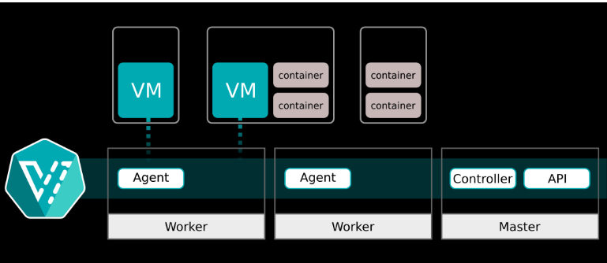
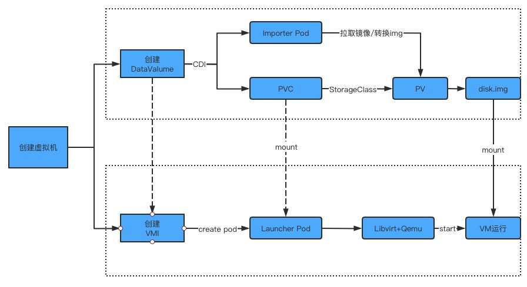
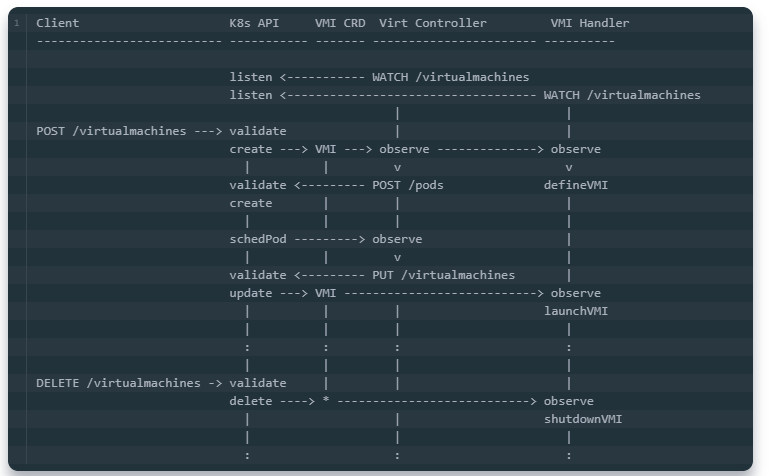
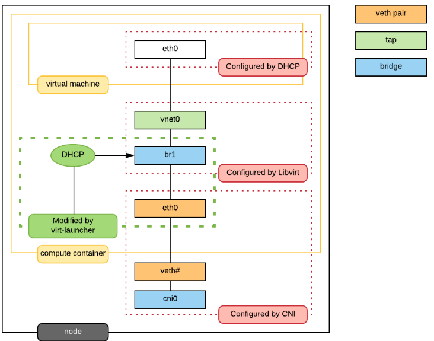

[TOC]

## 什么是 kubevirt

**[容器云原生虚拟化-Kubevirt-云社区-华为云 (huaweicloud.com)](https://bbs.huaweicloud.com/blogs/396481)**

[KubeVirt — 架构_kubevirb-CSDN 博客](https://blog.csdn.net/weixin_45804031/article/details/124873398)

[KubeVirt 的介绍 | kubernetes-notes (huweihuang.com)](https://k8s.huweihuang.com/project/kvm/kubevirt/kubevirt-introduction)

[KubeVirt 03：部署一个简单的 VM – 小菜园 (imxcai.com)](https://www.imxcai.com/k8s/kubevirt/kubevirt-03-deploy-simple-vm.html)

- kubevirt 是 Red Hat开源的以容器方式运行虚拟机的项目，是基于kubernetes运行，利用 **k8s CRD** 为增加资源类型VirtualkMachineInstance（VMI），使用CRD的方式是由于kubevirt对虚拟机的管理 不局限于pod管理接口。
- 通过CRD机制，kubevirt可以自定义额外的操作，来调整常规容器不可用的行为。
- kubevirt可以使用容器的image registry去创建虚拟机并提供VM生命周期管理。

- kubevirt架构设计

  - kubevirt主要实现了下面集中资源，以实现对虚拟机的管理

    > 资源：是K8S API的endpoint ,  可以通过api访问。

    1. VirtaulMachineInstance (VMI): 类似于kubernetes Pod, 是管理虚拟机的最小资源。
       - 一个VirtualMachineInstance 对象即表示一台正在运行的虚拟机实例，包含**一个虚拟机所需要的各种配置。**
       - VirtualMachine (VM): 为集群内的VirtualMachineInstance提供管理功能。例如开机/关机/重启虚拟机，确保虚拟机实例的启动状态，与虚拟机实例是1：1的关系，类似于sepc.relica为1的StatefulSet
       - VirtualMachineInstanceReplicaSet : 类似 ReplicaSet，可以启动指定数量的 VirtualMachineInstance，并且保证指定数量的 VirtualMachineInstance 运行，可以配置 HPA。

> vmi和 vm 关系
>
> vm和vmi的关系为：vmi对应虚拟机实例，vm则是在vmi的基础上的一层更完善的逻辑控制。通过vm创建的vmi虚拟机可以做到硬重启（删除vmi再创建vmi）等功能，单独的vmi虚拟机只能做到软重启、暂停等功能。

- kubevirt 是基于 k8s 之上，提供了一种通过 k8s 来编排和管理虚拟机的方式。
- kubevirt 以 CRD 的形式将 VM 管理接口接入到 kubernetes 中，通过一个 pod 去使用 libvirtd 管理 VM 的方式，实现pod与VM的一一对应，**可以实现如同像容器一样管理虚拟机**，并且做到了与容器一样的资源管理，资源规划。

- virt-api
  kubevirt是以CRD形式去管理VM Pod，virt-api就是所有虚拟化操作的入口，这里面包括常规的CDR更新验证、以及vnc、console、vm start、stop等操作。
- virt-controller
  virt-controller会根据vmi CRD，生成对应的virt-launcher Pod，并且维护CRD的状态。与kubernetes api-server通讯监控VMI资源的创建删除等状态。
- virt-handler
  virt-handler会以deamonset形式部署在每一个节点上，负责监控节点上的每个虚拟机实例状态变化，一旦检测到状态的变化，会进行响应并且确保相应的操作能够达到所需（理想）的状态。virt-handler还会保持集群级别VMI Spec与相应libvirt域之间的同步；报告libvirt域状态和集群Spec的变化；调用以节点为中心的插件以满足VMI Spec定义的网络和存储要求。
- virt-launcher
  每个virt-launcher pod对应着一个VMI，kubelet只负责virt-launcher pod运行状态，不会去关心VMI创建情况。virt-handler会根据CRD参数配置去通知virt-launcher去使用本地的libvirtd实例来启动VMI，随着Pod的生命周期结束，virt-lanuncher也会去通知VMI去执行终止操作；其次在每个virt-launcher pod中还对应着一个libvirtd，virt-launcher通过libvirtd去管理VM的生命周期，这样做到去中心化，不再是以前的虚拟机那套做法，一个libvirtd去管理多个VM。
- libvirtd
  每个VMI实例对应的Pod都会有一个libvirtd实例，virt-launcher借助于libvirtd来管理VMI实例的生命周期。

- 所以使用 KubeVirt 创建 VM 的流程可以概括为：

- 创建 VM 时，`virt-controller` 会向集群节点上的 `virt-handler` 发出信号，`virt-handler` 会为新的 VMI 创建 `virt-launcher` Pod，在 `virt-launcher` Pod 中将运行一个 `libvirtd` 的容器，以便将 VMI 作为一个孤立的进程来执行。
- 在 KubeVirt 中，VM 是一个模板（虚拟机模板（类似于esxi的模板）），用于在集群中创建 VM 的运行实例。
  VM 的运行实例就称为虚拟机实例 VMI，所以 VM 和 VMI 的关系类似于 Deployment 和 ReplicaSet 的关系。
  如果 VMI 删除了，会根据 VM 自动的生成一个新的实例。

> VM资源： 为群集内的 `VirtualMachineInstance` 提供管理功能，例如开机/关机/重启虚拟机，确保虚拟机实例的启动状态，与虚拟机实例是 1:1 的关系，类似与 `spec.replica` 为 1 的 StatefulSet。
>
> VMI（ VirtualMachineInstance ）资源： 类似于 kubernetes Pod，是管理虚拟机的最小资源。一个 `VirtualMachineInstance` 对象即表示一台正在运行的虚拟机实例，包含一个虚拟机所需要的各种配置。

### 磁盘和卷

- 虚拟机镜像（磁盘）是启动虚拟机必不可少的部分，kubevirt中提供多种方式的虚拟机磁盘，虚拟机镜像（磁盘）使用方式非常灵活。
  - PersistentVolumeClaim：使用PVC作为后端存储，适用于数据持久化，即在虚拟机重启或重建后数据依旧存在。使用PV类型可以是block和filesystem，使用filesystem时，会使用PVC上的 /disk.img, 格式为RAW格式的文件作为硬盘。block模式时，使用block volume 直接作为原始块设备提供给虚拟机。
  
  - ephemeral : 基于后端存储在本地做一个写时复制（COW）镜像层，所有的写入都在本地存储的镜像中，VM 实例停止时写入层就被删除，后端存储上的镜像不变化。
  
  - containerDisk : 基于 scratch 构建的一个 docker image，镜像中包含虚拟机启动所需要的虚拟机镜像，可以将该 docker image push 到 registry，使用时从 registry 拉取镜像，直接使用 containerDisk 作为 VMI 磁盘，数据是无法持久化的。
  
  - hostDisk : 使用节点上的磁盘镜像，类似于 hostpath，也可以在初始化时创建空的镜像。
  
  - dataVolume : 提供在虚拟机启动流程中自动将虚拟机磁盘导入 pvc 的功能，在不使用 DataVolume 的情况下，用户必须先准备带有磁盘映像的 pvc，然后再将其分配给 VM 或 VMI。dataVolume 拉取镜像的来源可以时 http，对象存储，另一块 PVC 等。
  
    > 虚拟机镜像（磁盘）是启动虚拟机必不可少的部分，KubeVirt 中提供多种方式的虚拟机磁盘，虚拟机镜像（磁盘）使用方式非常灵活。
    > KubeVirt支持在spec.volumes下指定多种类型的卷：
    > 	cloudInitConfigDrive：在通过给VM挂载一个文件系统，给cloud-init提供meta-data和user-data。
    > 	cloudInitNoCloud：在通过给VM挂载一个文件系统，给cloud-init提供meta-data和user-data，生成的文件格式与ConfigDrive不同。
    > 	containerDisk：指定一个包含qcow2或raw格式的Docker镜像，重启VM数据会丢失。
    > 	dataVolume：动态创建一个PVC，并用指定的磁盘映像填充该PVC，重启vm数据不会丢失。
    > 	emptyDisk：从宿主机上分配固定容量的空间，映射到VM中的一块磁盘，与emptyDir一样，emptyDisk的生命周期与VM等同，重启VM数据会丢失。
    > 	ephemeral：在VM启动时创建一个临时卷，VM关闭后自动销毁，临时卷在不需要磁盘持久性的任何情况下都很有用。
    > 	hostDisk：在宿主机上创建一个img镜像文件给VM使用。重启VM数据不会丢失。
    > 	persistentVolumeClaim：指定一个PVC创建一个块设备。重启VM数据不会丢失。
    > 	secret：使用Kubernetes的secret来存储和管理一些敏感数据，比如密码，token，密钥等敏感信息，并把这些信息注入给VM，可以动态更新到Pod，但是不能修改Pod中生成的iso文件，更不能更新到VM。要想更新到VM，需重启VM。
    > 	configMap：功能类似于secret，把configMap里的信息写入到iso磁盘中，挂给VM。
    > 	serviceAccount：功能类似为secret，把serviceAccount里的信息写入到iso磁盘中，挂给VM。
    > 	sysprep：以secret或configMap的形式，往VM写入sysprep。

### 虚拟机创建流程

1. client 发送创建VMI 命令到达k8s api server

2. k8s api 创建vmi对象

3. virt-controller监听到vmi创建时，根据vmi spec生成pod spec文件，创建pods

4. k8s调度创建pods

5. virt-controller监听到pods创建后，根据pods的调度node，更新vmi的nodeName

6. virt-handler监听到vmi nodeName 与自身节点匹配后，与pod内的virt-launcher 通信，virt-launcher创建虚拟机，并负责虚拟机生命周期管理

   

   

   虚拟机创建分为创建DataVolume和VMI两个流程：

   1. 创建DataVolume后，CDI组件创建对应的PVC并且关联到合适的PV，然后通过临时Importer Pod拉取虚拟机容器镜像绑定到DataVolume生成的PV中，并且将镜像转换成disk.img[文件存储](https://cloud.tencent.com/product/cfs?from_column=20065&from=20065)在PV中供虚拟机使用。
   2. 创建VMI后，等待disk.img转换成功，然后在对应的Node上启动Launcher Pod，并将CDI流程生成的PV挂载到Pod内，当做虚拟机启动的系统盘。Launcher根据VMI的定义生成定义虚拟机的XML文件，然后调用libvirt进程调用Qemu命令创建并且启动虚拟机。VMI会对Launcher Pod状态进行同步，反应VM运行的状态。

### 虚拟机网络

- kubevirt虚拟机网络使用的是pod网络也就是说，虚拟网络原生与pod之间是打通的。虚拟机具体的网络如图所示， virt-launcher pod网络的网卡不再挂有pod ip，而是作为虚拟机的虚拟网卡的与外部网络通信的交接物理网卡。 那么虚拟机是如何拿到pod的ip的呢，virt-launcher实现了简单的单ip dhcp server，就是需要虚拟机中启动dhclient，virt-launcher 服务会分配给虚拟机。

