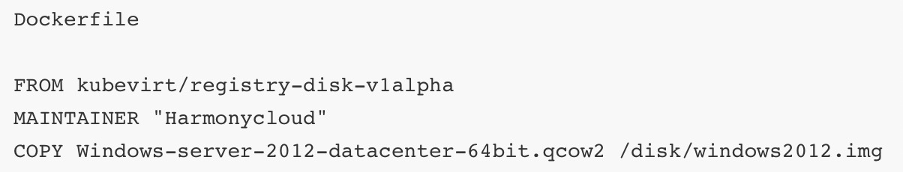
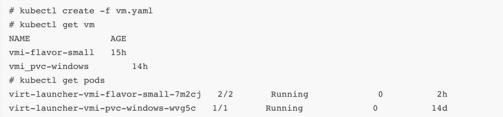

[制作KubeVirt镜像-数字星空 (shuzixingkong.net)](https://www.shuzixingkong.net/article/337)

[制作KubeVirt镜像-6ren](http://123.56.139.157:8082/article/92/8824341/detail.html)

### **创建虚拟机**

1. 准备一个虚拟机镜像

通过dockerfile构建出一个虚拟机镜像

2. 创建一台VM

编辑好yaml文件，通过kubectl命令拉起一台vm

