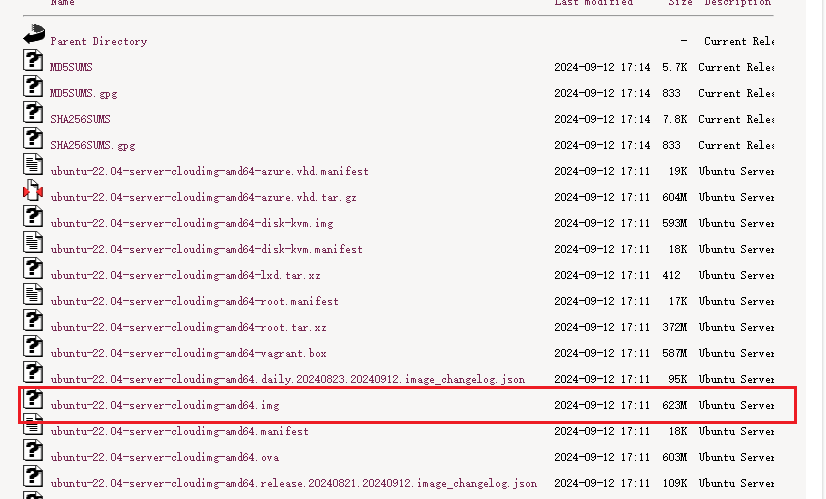
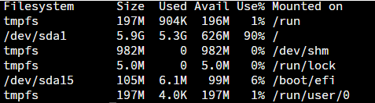
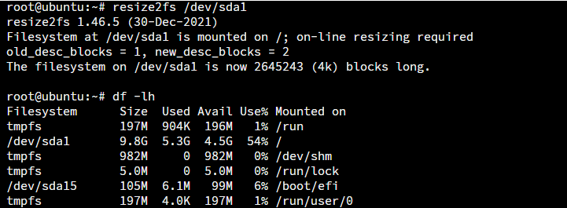
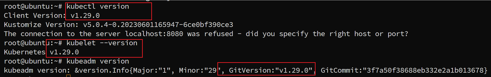

## 为什么要制作自定义镜像

- 由于cluster api需要通过kubevirt创建一个k8s集群，因此需要一个预装有k8s 相关组件的虚拟机镜像。这里我们选择cloud img作为我们的基础镜像，然后通过扩展存储容量，安装软件，配置cloud.cfg等操作来完成自定义镜像的制作。最后将镜像导入到containerd的本地镜像库中，从而让kubevirt能够直接使用。

## 镜像来源

- 从镜像网站上下载cloud img镜像，下面以[Ubuntu 22.04 LTS]([Ubuntu 22.04 LTS (Jammy Jellyfish) release [20240912\]](https://cloud-images.ubuntu.com/releases/jammy/release/))为例

  

## 制作kubevirt 使用的镜像

### 配置虚拟机网络

目标：物理机A是linux操作系统，安装虚拟机，需要和虚拟机之间要实现互访，同时虚拟机可以访问internet网络。物理机A的IP地址：10.128.118.233， ，虚拟机配置的IP地址为:192.168.6.16

#### 配置虚拟机网卡

- 给虚拟机分配网卡

1. 在物理机A（虚拟机宿主机）执行以下命令，生成一个虚拟网卡

```
#ip tuntap add tap-qemu mode tap
#ip addr add 192.168.6.1/24 dev tap-qemu
#ip link set tap-qemu up
```
2. 执行完以上命令后，通过ifconfig命令可以看到系统中增加了一个名为 tap-qemu 的网卡，如下图所示：

```
tap-qemu: flags=4163<UP,BROADCAST,RUNNING,MULTICAST>  mtu 1500
        inet 192.168.6.1  netmask 255.255.255.0  broadcast 0.0.0.0
        inet6 fe80::80f9:25ff:fe25:8344  prefixlen 64  scopeid 0x20<link>
        ether 82:f9:25:25:83:44  txqueuelen 1000  (以太网)
        RX packets 49685  bytes 5135568 (5.1 MB)
        RX errors 0  dropped 0  overruns 0  frame 0
        TX packets 95881  bytes 118790764 (118.7 MB)
        TX errors 0  dropped 0 overruns 0  carrier 0  collisions 0
```

#### 开启数据包转发功能

- 临时开启：

```
#echo 1 > /proc/sys/net/ipv4/ip_forward
```

- 永久开启，开机自动加载配置：

```
#echo net.ipv4.ip_forward=1 >>/etc/sysctl.conf

#sysctl -p
```

- 命令：sysctl -p 使用配置立即生效

#### 启动虚拟机

```
qemu-system-x86_64 \
    -m 2048 \
    -smp 4 \
    -hda qemu-img resize ubuntu-2204-server-cloudimg-amd64.img \
    -boot d \
    -nographic \
    -nic tap,ifname=tap-qemu,script=no
```

#### 配置虚拟机ip地址

```
IP：192.168.6.16

mask：255.255.255.0

网关：192.168.6.1

dns: 114.114.114.114

         8.8.8.8
```

- 说明：IP地址必须与宿主机分配的IP地址是在一个网段（需要与物理机A分配给虚拟网络tap-qemu的地址在同一个网段），网关必须为物理机A分配给虚拟网卡tap-qemu的地址。
- 通过以上步骤，可以实现宿主机与虚拟机之间的网络互通，即在宿主机（物理机A）可以ping通192.168.6.16地址，在虚拟机上可以ping通10.128.118.233

#### 让虚拟机可以访问互联网

- 通过第二步配置，虚拟机如果无法访问互联网，则需要在宿主机上增加路由转发功能，将虚拟机的请求转发的外网，可以先用iptables命令查看宿主机（物理机A）的路由转发信息，没有相关源地址为192.168.6.0/24网段的转发规则：

```
# iptables -t nat -nL --line-numbers
Chain PREROUTING (policy ACCEPT)
num  target     prot opt source               destination         

Chain INPUT (policy ACCEPT)
num  target     prot opt source               destination         

Chain OUTPUT (policy ACCEPT)
num  target     prot opt source               destination         

Chain POSTROUTING (policy ACCEPT)
num  target     prot opt source               destination
```

- 在宿主机（物理机A）用以下命令增加一条转发规则，将收到的

将收到的192.168.6.0/24网段数据转发到10.128.118.233上，再通过118网段转出外网，命令如下：

```
iptables -t nat -A POSTROUTING -s 192.168.6.0/24 -j SNAT --to-source 10.128.118.233
```

- 执行完上述命令后，再查看转发规则如下：

```
iptables -t nat -nL --line-numbers
Chain PREROUTING (policy ACCEPT)
num  target     prot opt source               destination         

Chain INPUT (policy ACCEPT)
num  target     prot opt source               destination         

Chain OUTPUT (policy ACCEPT)
num  target     prot opt source               destination         

Chain POSTROUTING (policy ACCEPT)
num  target     prot opt source               destination         
1    SNAT       all  --  192.168.6.0/24       0.0.0.0/0            to:10.128.118.233
```

- 这样虚拟机就可以正常上网了。

### 扩容镜像

- 由于基于镜像存储空间有限，因此需要对其进行扩容。

#### 使用qemu-img增加容量

```
qemu-img resize ubuntu-2204-server-cloudimg-amd64.img +4G
```

#### 查看img信息

```
qemu-img resize ubuntu-2204-server-cloudimg-amd64.img
```

#### 完成扩展后启动该虚拟机镜像

```
qemu-system-x86_64 \
    -m 2048 \
    -smp 4 \
    -hda qemu-img resize ubuntu-2204-server-cloudimg-amd64.img \
    -boot d \
    -nographic \
    -nic tap,ifname=tap-qemu,script=no
```

#### 进入虚拟机终端

1. 安装growpart相关工具

```
sudo apt install cloud-guest-utils
sudo apt install xfsprogs
```

2. 执行growpart指令对需要扩容的分区进行容量扩展操作，如下：

```
growpart /dev/sda 1    //参数是要操作的磁盘代号，需要扩容的分区id
reboot                 //要重启系统才能识别到新的分区大小
```

3. 重启系统后，直接执行lsblk就可以看到/分区已经扩大了，但是df-lh 看不到。



4. 使用resize2fs 指令对之前growpart过的分区进行一次重新扫描识别resize2fs /dev/sda1



### 配置ssh

1. 安装openssh-server

```
apt install openssh-server 
```

2. 使能openssh,修改sshd_config

```
# cat /etc/ssh/sshd_config
        
        #LoginGraceTime 2m
        PermitRootLogin yes
        #StrictModes yes
        #MaxAuthTries 6
        #MaxSessions 10
        PubkeyAuthentication yes
```

3. 修改/etc/ssh/sshd_config.d/60-cloudimg-settings.conf

```
# cat /etc/ssh/sshd_config.d/60-cloudimg-settings.conf
PasswordAuthentication yes 
```

4. 重启ssh

### 安装组件和导入镜像

#### 通过ssh 向虚拟机传输k8s v1.29.0相关的deb包和镜像

1. deb

```
conntrack_1%3a1.4.6-2build2_amd64.deb 
cri-tools_1.29.0-1.1_amd64.deb 
ebtables_2.0.11-4build2_amd64.deb 
ethtool_1%3a5.16-1_amd64.deb 
kubeadm_1.29.0-1.1_amd64.deb 
kubectl_1.29.0-1.1_amd64.deb 
kubelet_1.29.0-1.1_amd64.deb 
kubernetes-cni_1.3.0-1.1_amd64.deb
socat_1.7.4.1-3ubuntu4_amd64.deb
containerd_1.7.2-0ubuntu1~22.04.1_amd64.deb  runc_1.1.7-0ubuntu1~22.04.2_amd64.deb
```

2. 容器镜像tar包

```
kube-1.29.0.tar
calico-3.27.tar
import pause-3.9.tar
flannel-0.24.2.tar
```

#### 安装和导入

```
sudo dpkg -i *.deb
sudo ctr -n k8s.io images import *.tar
```

- 查看安装和导入的版本信息

```
kubeclt version
kubeadm version
kubelet --version
sudo ctr -n k8s.io images ls | grep kube
```




### 恢复网络初始配置

- 删除网络配置文件

```
rm /etc/netplan/00-install-config.yaml 
```

- 配置DHCP

```
# cd /etc/netplan
# rm -rf *
# touch  00-install-config.yaml 

#cat > 00-install-config.yaml << EOF
network:
  version: 2
  ethernets:
    ens3:
      dhcp4: true
EOF

# chmod 600 00-install-config.yaml 

# netplan apply

```

- 关机

```
shutdown -h now
```


### 导入镜像

#### 转化镜像格式

- 由于制作kubevirt 的镜像需要qcow2格式，因此使用命令将img格式变成qcow2格式

```
qemu-img convert -f qcow2 -O qcow2 ubuntu-22.04-server-cloudimg-amd64.img ubuntu-2204-server-cloudimg.qcow2
```

#### 基于qcow2镜像生成docker镜像

- 编写dockerfile 

```
FROM kubevirt/registry-disk-v1alpha 
ADD  ubuntu-2204-server-cloudimg-amd64.qcow2 /disk/ 
```

- 生成镜像

```
docker build -t quay.io/ubuntu-2204-server-cloudimg:v1.0 . 
```

- 将docker镜像保存tar文件

```
sudo docker save -o ubuntu2204.tar quay.io/ubuntu-2204-server-cloudimg:v1.0
```

- 使用ctr将tar导入到containerd本地镜像库

```
sudo ctr -n k8s.io images import  ubuntu2204.tar
```

- 查看镜像

```
sudo ctr -n k8s.io images ls | grep ubuntu               
```


## 基于镜像创建cluster 集群

- 创建集群yaml文件,
  1. 默认网络配置，capi-quickstart.yaml 

```
apiVersion: cluster.x-k8s.io/v1beta1
kind: Cluster
metadata:
  name: capi-quickstart
  namespace: default
spec:
  clusterNetwork:
    pods:
      cidrBlocks:
      - 10.243.0.0/16
    services:
      cidrBlocks:
      - 10.95.0.0/16
  controlPlaneRef:
    apiVersion: controlplane.cluster.x-k8s.io/v1beta1
    kind: KubeadmControlPlane
    name: capi-quickstart-control-plane
    namespace: default
  infrastructureRef:
    apiVersion: infrastructure.cluster.x-k8s.io/v1alpha1
    kind: KubevirtCluster
    name: capi-quickstart
    namespace: default
---
apiVersion: infrastructure.cluster.x-k8s.io/v1alpha1
kind: KubevirtCluster
metadata:
  name: capi-quickstart
  namespace: default
spec:
  controlPlaneServiceTemplate:
    spec:
      type: LoadBalancer
---
apiVersion: infrastructure.cluster.x-k8s.io/v1alpha1
kind: KubevirtMachineTemplate
metadata:
  name: capi-quickstart-control-plane
  namespace: default
spec:
  template:
    spec:
      virtualMachineBootstrapCheck:
        checkStrategy: ssh
      virtualMachineTemplate:
        metadata:
          namespace: default
        spec:
          runStrategy: Always
          template:
            spec:
              domain:
                cpu:
                  cores: 2
                devices:
                  disks:
                  - disk:
                      bus: virtio
                    name: containervolume
                  networkInterfaceMultiqueue: true
                memory:
                  guest: 4Gi
              evictionStrategy: External
              volumes:
              - containerDisk:
                  image: quay.io/ubuntu-2204-server-cloudimg:v1.7
                name: containervolume
---
apiVersion: controlplane.cluster.x-k8s.io/v1beta1
kind: KubeadmControlPlane
metadata:
  name: capi-quickstart-control-plane
  namespace: default
spec:
  kubeadmConfigSpec:
    clusterConfiguration:
      networking:
        dnsDomain: capi-quickstart.default.local
        podSubnet: 10.243.0.0/16
        serviceSubnet: 10.95.0.0/16
    initConfiguration:
      nodeRegistration:
        criSocket: /var/run/containerd/containerd.sock
    joinConfiguration:
      nodeRegistration:
        criSocket: /var/run/containerd/containerd.sock
  machineTemplate:
    infrastructureRef:
      apiVersion: infrastructure.cluster.x-k8s.io/v1alpha1
      kind: KubevirtMachineTemplate
      name: capi-quickstart-control-plane
      namespace: default
  replicas: 1
  version: v1.29.0
---
apiVersion: infrastructure.cluster.x-k8s.io/v1alpha1
kind: KubevirtMachineTemplate
metadata:
  name: capi-quickstart-md-0
  namespace: default
spec:
  template:
    spec:
      virtualMachineBootstrapCheck:
        checkStrategy: ssh
      virtualMachineTemplate:
        metadata:
          namespace: default
        spec:
          runStrategy: Always
          template:
            spec:
              domain:
                cpu:
                  cores: 2
                devices:
                  disks:
                  - disk:
                      bus: virtio
                    name: containervolume
                  networkInterfaceMultiqueue: true
                memory:
                  guest: 4Gi
              evictionStrategy: External
              volumes:
              - containerDisk:
                  image: quay.io/ubuntu-2204-server-cloudimg:v1.7
                name: containervolume
---
apiVersion: bootstrap.cluster.x-k8s.io/v1beta1
kind: KubeadmConfigTemplate
metadata:
  name: capi-quickstart-md-0
  namespace: default
spec:
  template:
    spec:
      joinConfiguration:
        nodeRegistration:
          kubeletExtraArgs: {}
---
apiVersion: cluster.x-k8s.io/v1beta1
kind: MachineDeployment
metadata:
  name: capi-quickstart-md-0
  namespace: default
spec:
  clusterName: capi-quickstart
  replicas: 1
  selector:
    matchLabels: null
  template:
    spec:
      bootstrap:
        configRef:
          apiVersion: bootstrap.cluster.x-k8s.io/v1beta1
          kind: KubeadmConfigTemplate
          name: capi-quickstart-md-0
          namespace: default
      clusterName: capi-quickstart
      infrastructureRef:
        apiVersion: infrastructure.cluster.x-k8s.io/v1alpha1
        kind: KubevirtMachineTemplate
        name: capi-quickstart-md-0
        namespace: default
      version: v1.29.0
```

2. 自定义网络的集群yaml

```
apiVersion: cluster.x-k8s.io/v1beta1
kind: Cluster # 定义了集群的基本网络配置，指定了控制平面和基础设施的引用。
metadata:
  name: capi-quickstart
  namespace: default
spec:
  clusterNetwork:
    pods:
      cidrBlocks:
      - 111.166.0.0/16
    services:
      cidrBlocks:
      - 112.167.0.0/16
  controlPlaneRef:
    apiVersion: controlplane.cluster.x-k8s.io/v1beta1
    kind: KubeadmControlPlane
    name: capi-quickstart-control-plane
    namespace: default
  infrastructureRef:
    apiVersion: infrastructure.cluster.x-k8s.io/v1alpha1
    kind: KubevirtCluster
    name: capi-quickstart
    namespace: default
---
apiVersion: infrastructure.cluster.x-k8s.io/v1alpha1
kind: KubevirtCluster # 配置了 KubeVirt 基础设施的具体参数，如控制平面EndPoint。
metadata:
  name: capi-quickstart
  namespace: default
spec:
  controlPlaneEndpoint:
    host: 179.165.122.3
    port: 6443
---
apiVersion: infrastructure.cluster.x-k8s.io/v1alpha1
kind: KubevirtMachineTemplate # 定义了控制节点的虚拟机模板，包括 CPU 核数、内存大小、磁盘配置等。
metadata:
  name: capi-quickstart-control-plane
  namespace: default
spec:
  template:
    spec:
      virtualMachineBootstrapCheck:
        checkStrategy: ssh
      virtualMachineTemplate:
          metadata:
              namespace: default                  
          spec:
              runStrategy: Always
              template:
                  metadata:
                      labels:
                          kubevirt.io/size: small
                  spec:
                      domain:
                          cpu:
                              cores: 2
                          devices:
                              disks:
                                  - name: containervolume
                                    disk:
                                      bus: virtio
                              interfaces: # 指定虚拟机前端网卡接口类型
                                  - name: data0
                                    bridge: {}
                          resources:
                              requests:
                                memory: 2048M
                      networks: # 指定后端网络类型
                          - name: data0
                            multus:
                              networkName: data0
                      volumes:
                          - name: containervolume
                            containerDisk:
                              image: quay.io/ubuntu-2204-server-cloudimg:v1.7  #指定虚拟机镜像
                              imagePullPolicy: IfNotPresent
---
apiVersion: controlplane.cluster.x-k8s.io/v1beta1
kind: KubeadmControlPlane # 设置了 Kubeadm 控制平面的配置，包括初始化和加入集群时使用的配置信息，以及控制节点的数量和版本。
metadata:
  name: capi-quickstart-control-plane
  namespace: default
spec:
  kubeadmConfigSpec:
    clusterConfiguration:
      networking:
        dnsDomain: capi-quickstart.default.local
        podSubnet: 111.166.0.0/16
        serviceSubnet: 112.167.0.0/16
    initConfiguration:
      nodeRegistration:
        criSocket: /var/run/containerd/containerd.sock
    joinConfiguration:
      nodeRegistration:
        criSocket: /var/run/containerd/containerd.sock
  machineTemplate:
    infrastructureRef:
      apiVersion: infrastructure.cluster.x-k8s.io/v1alpha1
      kind: KubevirtMachineTemplate
      name: capi-quickstart-control-plane
      namespace: default
  replicas: 1 #控制平面节点数量
  version: v1.29.0
---
apiVersion: infrastructure.cluster.x-k8s.io/v1alpha1
kind: KubevirtMachineTemplate # 与控制节点类似，定义的是工作节点的虚拟机模板。
metadata:
  name: capi-quickstart-md-0
  namespace: default
spec:
  template:
    spec:
      virtualMachineBootstrapCheck:
        checkStrategy: ssh
      virtualMachineTemplate:
          metadata:
              namespace: default                  
          spec:
              runStrategy: Always
              template:
                  metadata:
                      labels:
                          kubevirt.io/size: small
                  spec:
                      domain:
                          cpu:
                              cores: 2
                          devices:
                              disks:
                                  - name: containervolume
                                    disk:
                                      bus: virtio
                              #networkInterfaceMultiqueue: true
                              interfaces:
                                  - name: data0
                                    bridge: {}
                          resources:
                              requests:
                                memory: 2048M
                          #memory:
                          #   guest: 4Gi
                      networks:
                          - name: data0
                            multus:
                              networkName: data0
                      evictionStrategy: External
                      volumes:
                          - name: containervolume
                            containerDisk:
                              image: quay.io/ubuntu-2204-server-cloudimg:v1.7 
                              imagePullPolicy: IfNotPresent
---
apiVersion: bootstrap.cluster.x-k8s.io/v1beta1
kind: KubeadmConfigTemplate # 提供了用于节点加入集群时的配置模板，例如可以添加额外的 `kubelet` 参数。
metadata:
  name: capi-quickstart-md-0
  namespace: default
spec:
  template:
    spec:
      joinConfiguration:
        nodeRegistration:
          kubeletExtraArgs: {}
---
apiVersion: cluster.x-k8s.io/v1beta1
kind: MachineDeployment # 用上述定义的模板来部署实际的工作节点，指定了副本数量、选择器以及版本信息。
metadata:
  name: capi-quickstart-md-0
  namespace: default
spec:
  clusterName: capi-quickstart
  replicas: 1 # 工作节点副本数量
  selector:
    matchLabels: null
  template:
    spec:
      bootstrap:
        configRef:
          apiVersion: bootstrap.cluster.x-k8s.io/v1beta1
          kind: KubeadmConfigTemplate
          name: capi-quickstart-md-0
          namespace: default
      clusterName: capi-quickstart
      infrastructureRef:
        apiVersion: infrastructure.cluster.x-k8s.io/v1alpha1
        kind: KubevirtMachineTemplate
        name: capi-quickstart-md-0
        namespace: default
      version: v1.29.0
```

- 应用yaml文件创建集群

```
kubectl apply -f capi-quickstart.yaml 
```

- 经过若干分钟后，使用kubectl get cluster, kubectl get vm, kubectl get vmi 即可看到集群创建情况，和虚拟机状态。

- 通过virtctl console <虚拟机>，可以进入虚拟机节点
  1. 配置kubeconfig文件:

  ```
  mkdir -p $HOME/.kube
  sudo cp -i /etc/kubernetes/admin.conf $HOME/.kube/config
  sudo chown $(id -u):$(id -g) $HOME/.kube/config
  ```

  2. 查看节点状态

  ```
  kubectl get nodes
  ```

  > yaml 介绍
  >
  > 1. **Cluster**:
  >    - 定义了集群的基本网络配置。
  >    - 指定了控制平面和基础设施的引用。
  > 2. **KubevirtCluster**:
  >    - 配置了 KubeVirt 基础设施的具体参数，如控制平面服务类型为 `LoadBalancer`。
  > 3. **KubevirtMachineTemplate (control-plane)**:
  >    - 定义了控制节点的虚拟机模板，包括 CPU 核数、内存大小、磁盘配置等。
  > 4. **KubeadmControlPlane**:
  >    - 设置了 Kubeadm 控制平面的配置，包括初始化和加入集群时使用的配置信息，以及控制节点的数量和版本。
  > 5. **KubevirtMachineTemplate (worker node)**:
  >    - 与控制节点类似，但这里定义的是工作节点的虚拟机模板。
  > 6. **KubeadmConfigTemplate**:
  >    - 提供了用于节点加入集群时的配置模板，例如可以添加额外的 `kubelet` 参数。
  > 7. **MachineDeployment**:
  >    - 使用上述定义的模板来部署实际的工作节点，指定了副本数量、选择器以及版本信息。
  >
  > 通过这些 YAML 文件，可以自动化地创建一个包含控制面和服务于该集群的工作节点的完整 Kubernetes 环境。这种方式非常适合在云环境中快速搭建和管理 Kubernetes 集群。