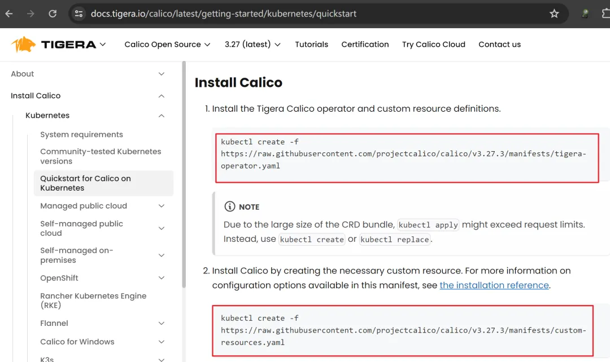

## 1. 内核升级

> 所有主机都需要处理

开始之前，还是先处理一下内核吧。

内核是否升级取决于你使用的软件版本而决定，我的个人建议是升一下，有新特性可以用，特别是针对k8s的`CNI`插件。

比如你想使用`Calico`，进到官方文档`https://docs.tigera.io/calico/latest/getting-started/kubernetes/requirements`，你就可以看到，目前的`Calico`，使用`3.10`版本内核就可以支持了；

但是如果你想用Cilium，进到官方文档`https://docs.cilium.io/en/stable/gettingstarted/k8s-install-default/`，你就可以看到，目前的`Cilium`，至少需要`4.9.17`.

总之，建议升级，实际情况实际处理就行。

```
# 导入elrepo gpg key
$ rpm --import https://www.elrepo.org/RPM-GPG-KEY-elrepo.org
# 安装elrepo YUM源仓库
$ yum -y install https://www.elrepo.org/elrepo-release-7.0-4.el7.elrepo.noarch.rpm
# 列出所有可用的内核包
$ yum --enablerepo="elrepo-kernel" -y list available | grep kernel
# 安装kernel-lt版本，ml为长期稳定版本，lt为长期维护版本
$ yum --enablerepo="elrepo-kernel" -y install kernel-lt.x86_64
# 设置grub2默认引导为0
$ grub2-set-default 0
# 重新生成grub2引导文件
$ grub2-mkconfig -o /boot/grub2/grub.cfg
# 更新后重启，使用升级的内核启动
$ reboot
# 验证内核版本是否是新版本
$ uname -a
Linux master1 5.4.272-1.el7.elrepo.x86_64 #1 SMP Fri Mar 15 16:26:13 EDT 2024 x86_64 x86_64 x86_64 GNU/Linux
```

如上，内核已经升级到5.4，使用的是长期维护版本5.x的内核。

## 2. 环境准备

日常建议master保证有最少4G的RAM，node节点2G以上，然后就是开搞！

### 主机配置

```
# 安装必要软件，这个一定要装哦，帮各位踩过坑了
$ yum install -y socat
# 修改对应机器的hostname
# master节点
$ hostnamectl set-hostname master1
# node节点
$ hostnamectl set-hostname node1
# 修改hosts文件
$ vim /etc/hosts
192.168.2.32 master1
192.168.2.33 node1
```

### 关闭防火墙

> 所有主机都需要处理

```
# 取消开机启动
$ systemctl disable firewalld
# 停止防火墙
$ systemctl stop firewalld
# 查看状态
$ firewall-cmd --state
not running
$
```

### 关闭swap

> 所有主机都需要处理

```
# 手动临时关闭
$ swapoff -a
# 注释掉swap分区挂载，永久生效，这个需要重启
$ vim /etc/fstab
# 验证, 执行free命令，输出swap的行全是0
$ free
```

本次可以先临时关闭，然后修改`/etc/fstab`这个文件，确保下次启动不会加载swap分区即可。

### 关闭SELinux

> 所有主机都需要处理

```
# 修改SELinux配置文件，将SELINUX=enforcing改为disabled
$ sed -i 's/SELINUX=enforcing/SELINUX=disabled/g' /etc/selinux/config
```

操作完后需要重启机器，重启完后验证下状态，以下输出表示已经关闭，这一步必须要验证！

```
$ sestatus
SELinux status:                 disabled
$ 
```

如果你是使用`setenforce 0`临时关闭的话，`sestatus`的输出不会是disabled哦，记得重启！

### 时间同步

> 所有主机都需要处理

这个配置可选，如果你觉得你机器时间ok的话，也可以略过这个操作，不过我的建议是配一下，我反正是没配，主打一个懒。

配时间同步首选需要安装ntp服务，然后把机器的时间和时间服务器进行同步，这里用的是阿里云时间服务器，cron表达式一个小时同步一次。

```
# crontab -l
$ 0 */1 * * * /usr/sbin/ntpdate time1.aliyun.com
```

###  配置内核路由转发及网桥过滤

> 所有主机都需要处理

```
# 添加网桥过滤及内核转发配置文件
$ cat > /etc/sysctl.d/k8s.conf << EOF
net.bridge.bridge-nf-call-ip6tables = 1
net.bridge.bridge-nf-call-iptables = 1
net.ipv4.ip_forward = 1
EOF
# 加载br_netfilter模块
$ modprobe br_netfilter
# 检查是否加载
$ lsmod | grep br_netfilter
br_netfilter           28672  0
# 让/etc/sysctl.d/k8s.conf配置生效，这个必须要加载br_netfilter模块之后才不会报错
$ sysctl -p /etc/sysctl.d/k8s.conf
# 或者这个命令也可以使其生效
$ sysctl --system
# 这两个别忘了，要不然等哈初始化集群就该提示你了
$ echo 1 > /proc/sys/net/bridge/bridge-nf-call-iptables
$ echo 1 > /proc/sys/net/ipv4/ip_forward
```

> 开机自动加载

写个脚本，放到`/etc/sysconfig/modules/`下，让系统自动加载。

```
$ cat > /etc/sysconfig/modules/br_netfilter << EOF
#!/bin/bash
modprobe br_netfilter
echo 1 > /proc/sys/net/bridge/bridge-nf-call-iptables
echo 1 > /proc/sys/net/ipv4/ip_forward
EOF
# 添加权限, 包括可执行权限
$ chmod +755 /etc/sysconfig/modules/ipvs.modules
```

### 安装ipset和ipvsadm

> 所有主机都需要处理

这一步是非必须的，如果你的k8s网络走iptables模式，你就可以不需要这一步的操作。

如果你需要将iptables切换成ipvs模式，那就跟着走吧。

```
# 安装ipset和ipvsadm
# ipset 可以用来实现路由的汇总
# ipvsadm 可以在client对vs进行查看
$ yum install -y ipset ipvsadm
```

ipvs在工作时需要加载一些模块，但这些模块Linux是默认不加载的，所以我们写个脚本，放到`/etc/sysconfig/modules/`下，让系统自动加载。

```
# 配置ipvsadm模块加载方式
# 添加需要加载的模块
$ cat > /etc/sysconfig/modules/ipvs.modules << EOF
#!/bin/bash
modprobe -- ip_vs
modprobe -- ip_vs_rr
modprobe -- ip_vs_wrr
modprobe -- ip_vs_sh
modprobe -- nf_conntrack
EOF
# 添加权限, 包括可执行权限
$ chmod +755 /etc/sysconfig/modules/ipvs.modules
```

处理好之后，开机就会自动加载了，但是本次需要临时手动加载一下。

```
# 执行一下
$ /etc/sysconfig/modules/ipvs.modules
# 验证以下
$ lsmod | grep ip_vs
```

## 容器运行时准备

> 所有主机都需要处理

k8s支持很多容器运行时，只要符合k8s `CRI`接口的容器运行时，都可以在k8s集群中运行，在1.24之前k8s默认是用的`docker`，1.24之后默认的容器运行时变成了`containerd`，本次也是直接准备`containerd`作为运行时。

由于安装`containerd`的教程在上一篇《[Containerd，我不允许你还不会这玩意儿！](http://mp.weixin.qq.com/s?__biz=MzI0NzcwODY0NA==&mid=2247485174&idx=1&sn=41700b64c4378ec662fd575f026b9a0d&chksm=e9aaa87ddedd216b0d17e3a0a0716cf807416ca25226da9506ca0888ae1bc184466fa096fecf&scene=21#wechat_redirect)》中已经详细解释过了，这里就不在赘述了，简单快速过一下安装流程。

**需要注意的一点是，本次安装需要生成`containerd`的配置文件，并修改一部分内容。由于是和k8s集成，因此我们不需要单独为`containerd`安装CNI plugins。**

文件下载地址:

```
* containerd:  https://github.com/containerd/containerd/releases
* runc:        https://github.com/opencontainers/runc/releases
```

###  安装文件清单

```
# containerd
containerd-$VERSION-$OS-$ARCH.tar.gz: containerd的安装包，不包含runc
cri-containerd-$VERSION-$OS-$ARCH.tar.gz: 已过时，我们只用里面的系统服务service文件，不免的手写
# runc
runc.$arch: runc安装包
```

###  containerd安装

```
# 直接解压到目标目录
$ tar -zxvf containerd-1.7.14-linux-amd64.tar.gz -C /usr/local
# 解压获取service文件
$ tar -zxvf cri-containerd-1.7.14-linux-amd64.tar.gz
# 拷贝解压出来的service文件到linux系统服务
$ mv etc/systemd/system/containerd.service /etc/systemd/system/containerd.service
```

###  配置文件准备并启动

准备containerd的配置文件

```
$ mkdir /etc/containerd
# 生成默认的配置文件
$ containerd config default > /etc/containerd/config.toml
```

修改配置文件中pause镜像改为你使用的镜像源的3.9版本，我这里使用的是阿里源的，这里为什么要改后面会解释。

```
# vim /etc/containerd/config.toml
sandbox_image = "registry.aliyuncs.com/google_containers/pause:3.9"
# 刷新服务，设置为开机启动，并启动，检查状态
$ systemctl daemon-reload
$ systemctl enable containerd
$ systemctl start containerd
$ systemctl status containerd
```

###  runc安装

```
# 重命名
$ mv runc.amd64 runc
# 添加可执行权限
$ chmod +x runc
# 移动到环境变量路径下
$ mv runc /usr/local/sbin/
# 检查runc版本
$ runc -v
runc version 1.1.12
commit: v1.1.12-0-g51d5e946
spec: 1.0.2-dev
go: go1.20.13
libseccomp: 2.5.4
$
```

## k8s安装

###  yum源准备

> 所有主机都需要处理

日常去阿里开发者社区，找k8s的yum源，看好版本哦，改成1.29，最新版。

```
cat <<EOF | tee /etc/yum.repos.d/kubernetes.repo
[kubernetes]
name=Kubernetes
baseurl=https://mirrors.aliyun.com/kubernetes-new/core/stable/v1.29/rpm/
enabled=1
gpgcheck=1
gpgkey=https://mirrors.aliyun.com/kubernetes-new/core/stable/v1.29/rpm/repodata/repomd.xml.key
EOF
# 重新构建yum cache
$ yum clean all
$ yum makecache
# 搜索一下是否有对应的版本
$ yum list kubeadm --showduplicates | sort -r
kubeadm.x86_64                   1.29.3-150500.1.1                    kubernetes
$
```

### k8s相关软件安装

> 所有主机都需要处理

```
# 我直接安装最新版，你也可以指定版本，比如kubeadm-1.29.3-150500.1.1
$ yum install -y kubeadm kubelet kubectl
```

修改kubelet使用的cgroupdriver，如果使用的是containerd的话，其实不需要修改也可以，好习惯，改一下。

```
# vim /etc/sysconfig/kubelet
KUBELET_EXTRA_ARGS="--cgroup-driver=systemd"
```

设置kubelet开机自启动，由于还没有生成配置文件，我们暂时不启动它，等集群初始化后自动启动。

```
$ systemctl enable kubelet
```

###  镜像准备

如果你网络好的话，可以跳过这一步，集群初始化的时候也会自动下载镜像，我们先来查看所需镜像。

```
# 查看所需的镜像源
$ kubeadm config images list
registry.k8s.io/kube-apiserver:v1.29.3
registry.k8s.io/kube-controller-manager:v1.29.3
registry.k8s.io/kube-scheduler:v1.29.3
registry.k8s.io/kube-proxy:v1.29.3
registry.k8s.io/coredns/coredns:v1.11.1
registry.k8s.io/pause:3.9
registry.k8s.io/etcd:3.5.12-0
$ 
```

看到没，这个地方的pause容器是3.9的，这就是修改containerd配置文件pause容器版本的原因。

由于网络原因，registry.k8s.io的镜像源你可能拉不下来，所以我这里直接使用ali的镜像源。

```
# 指定镜像仓库，直接拉取相关镜像
$ kubeadm config images pull --image-repository registry.aliyuncs.com/google_containers
```

这个地方有个坑，由于我默认的dns解析配的是默认的网关`192.168.2.2`，指定阿里镜像源地址的时候，你ping这个域名是能ping通的，但是拉镜像就会报错。

```
dial tcp: lookup registry.aliyuncs.com on 192.168.2.2:53: no such host"
```

这个时候记得把你的dns地址只保留`8.8.4.4`。

```
$ cat /etc/resolv.conf
nameserver 8.8.4.4
```

镜像拉取完之后，就可以开始初始化集群了。

#### 

### 集群初始化

> 仅master节点执行

```
# master节点执行集群初始化
$ kubeadm init \
--image-repository registry.aliyuncs.com/google_containers \
--kubernetes-version=1.29.3 \
--pod-network-cidr=10.10.0.0/16 \
--apiserver-advertise-address=192.168.2.32 \
--cri-socket unix:///run/containerd/containerd.sock
```

配置解释

- `image-repository`: 指定镜像源地址
- `kubernetes-version`: 指定集群版本，如果是最新版，可以不用指定
- `pod-network-cidr`: 指定pod使用的网络，这个请记住，后面安装插件会用
- `apiserver-advertise-address`: 指定apiserver使用的机器ip，我们直接使用master节点ip就行
- `cri-socket`: 指定cri-socket，如果使用的是containerd，是不需要指定的，使用cri-docker或其他cri时，可以通过这个配置来指定

由于刚刚拉取的是阿里源的镜像，因此指定了镜像源地址，或者你也可以重新把拉取的镜像重新打个tag，搞成和默认的一致后再使用。

如果你看到以下输出，那就说明你初始化成功了。

```
Your Kubernetes control-plane has initialized successfully!

To start using your cluster, you need to run the following as a regular user:

  mkdir -p $HOME/.kube
  sudo cp -i /etc/kubernetes/admin.conf $HOME/.kube/config
  sudo chown $(id -u):$(id -g) $HOME/.kube/config

Alternatively, if you are the root user, you can run:

  export KUBECONFIG=/etc/kubernetes/admin.conf

You should now deploy a pod network to the cluster.
Run "kubectl apply -f [podnetwork].yaml" with one of the options listed at:
  https://kubernetes.io/docs/concepts/cluster-administration/addons/

Then you can join any number of worker nodes by running the following on each as root:

kubeadm join 192.168.2.32:6443 --token flhajl.e9952e3p97nnue15 \
	--discovery-token-ca-cert-hash sha256:193e3f526747ec071f7588cf6b56f5144812640f49f29a0215dfe6eca7ec319a
```

这个时候你使用`kubectl get nodes`命令还是不行的，你会看到如下报错。

```
$ kubectl get nodes
E0406 10:57:35.647622    3090 memcache.go:265] couldn't get current server API group list: Get "http://localhost:8080/api?timeout=32s": dial tcp [::1]:8080: connect: connection refused
```

我们还要准备它的配置文件，复制输出中的命令并执行。

```
$ mkdir -p $HOME/.kube
$ sudo cp -i /etc/kubernetes/admin.conf $HOME/.kube/config
$ sudo chown $(id -u):$(id -g) $HOME/.kube/config
```

执行完之后，你就可以看到一个NotReady的master节点。

```
$ kubectl get nodes
NAME      STATUS     ROLES           AGE    VERSION
master1   NotReady   control-plane   6m4s   v1.29.3
```

NotReady的原因是因为我们还没有为k8s安装网络插件，网络插件最后再安装，我们先把node节点添加进来。

###  添加node节点

> 在node节点执行

同样是复制初始化成功后输出的命令，然后再node节点执行。

```
$ kubeadm join 192.168.2.32:6443 --token flhajl.e9952e3p97nnue15 \
	--discovery-token-ca-cert-hash sha256:193e3f526747ec071f7588cf6b56f5144812640f49f29a0215dfe6eca7ec319a
```

如果你看到以下输出，那说明你的node节点就加进去了。

```
Run 'kubectl get nodes' on the control-plane to see this node join the cluster.
```

然后去master节点看看。

```
$ kubectl get nodes
NAME      STATUS     ROLES           AGE   VERSION
master1   NotReady   control-plane   23m   v1.29.3
node1     NotReady   <none>          95s   v1.29.3
```

可以看到，node节点加进去了，虽然还是NotReady.

细心的小伙伴可能想问，如果这个加入节点的命令里面的token忘记了怎么办？就这么办，来吧。

```
$ kubeadm token create --print-join-command
```

## 部署网络插件

###  Calico部署

常用的网络插件有fannel，calico，cilium等，在下本次采用普遍使用的Calico。

Calico的部署非常简单，跟着官方文档傻瓜式操作就行了，由于Calico更新可能比较频繁，因此建议各位在部署时直接进官网复制。

```
# 官方文档
https://docs.tigera.io/calico/latest/getting-started/kubernetes/quickstart
```

总共就两步，但是需要注意的是第二步不能直接执行，我们一步一步来。



calico_doc

先来第一步，直接复制，然后执行就好。

```
$ kubectl create -f https://raw.githubusercontent.com/projectcalico/calico/v3.27.3/manifests/tigera-operator.yaml
```

执行完之后，检查命名空间是否建立，operator是否正常启动，我们需要在operator正常启动之后，才执行第二步操作。

```
$ kubectl get ns
NAME              STATUS   AGE
...
tigera-operator   Active   74s
$ kubectl get po -n tigera-operator
NAME                               READY   STATUS    RESTARTS   AGE
tigera-operator-6bfc79cb9c-hb2wd   1/1     Running   0          81s
$
```

在operator正常运行后，继续执行下一步。

这次我们只复制链接，需要先下载这个yaml文件，并且将使用的网段，修改成我们初始化集群时使用的网段，也就是`10.10.0.0/16`

```
# 下载
$ wget https://raw.githubusercontent.com/projectcalico/calico/v3.27.3/manifests/custom-resources.yaml
# vim custom-resources.yaml 编辑并修改网段
$ vim custom-resources.yaml
# 修改完后执行部署
$ kubectl create -f custom-resources.yaml
# 官方文档第三步，监视calico部署情况
$ watch kubectl get pods -n calico-system
```

当所有pod都启动好之后，我们就可以来检查并验证集群情况了。

###  验证

首先来看看节点状态，是否都Ready了。

```
$ kubectl get nodes
NAME      STATUS   ROLES           AGE   VERSION
master1   Ready    control-plane   11h   v1.29.3
node1     Ready    <none>          10h   v1.29.3
```

查看kube-system命名空间下的service，检查DNS解析是否正常。

```
# 查看集群的service
$ kubectl get svc -n kube-system
NAME       TYPE        CLUSTER-IP   EXTERNAL-IP   PORT(S)                  AGE
kube-dns   ClusterIP   10.96.0.10   <none>        53/UDP,53/TCP,9153/TCP   11h
# 把 www.baidu.com 域名扔给集群ip，检查是否能够正常解析
$ dig -t a www.baidu.com @10.96.0.10
...
www.baidu.com.		25	IN	CNAME	www.a.shifen.com.
www.a.shifen.com.	25	IN	A	183.2.172.42
www.a.shifen.com.	25	IN	A	183.2.172.185
...
```

如上所示，没有明显，输出正常，DNS正常解析，那这个集群就OK了。