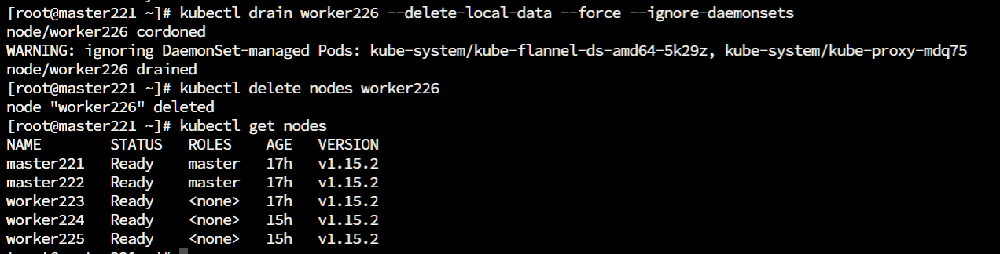
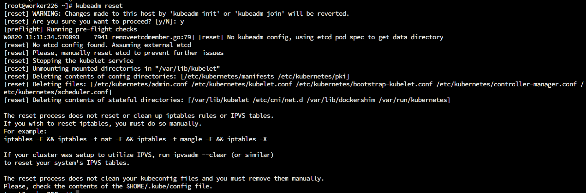
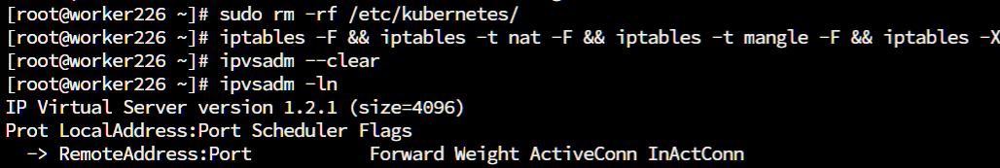
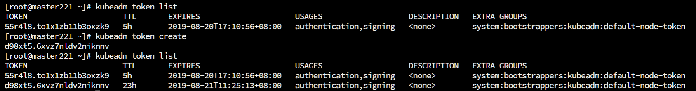
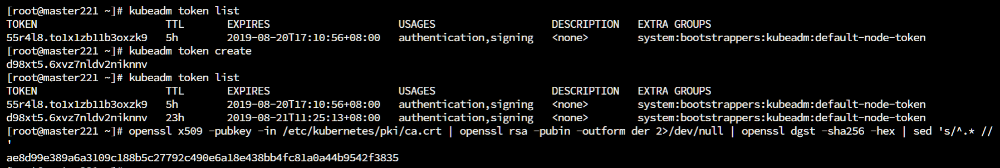
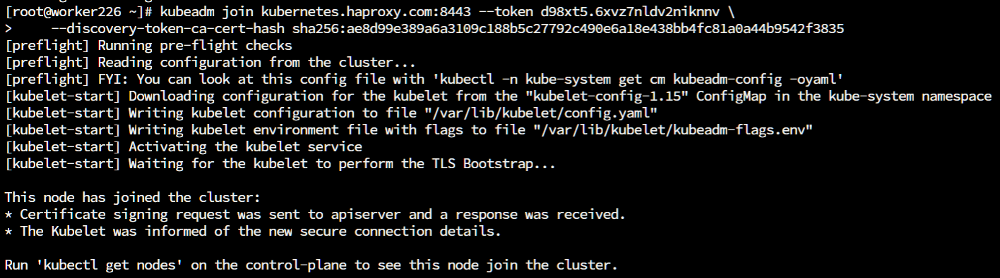
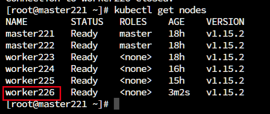

简单介绍一下在k8s集群中删除节点和添加节点的方法。

 

## 0x01 删除节点

如果需要在k8s集群中删除节点，首先需要在master节点上删除该节点的相关数据，再删除该节点，接着在该节点上进行reset操作，接着删除相关文件。

### 1.1 在Master节点操作

```
# 其中< node name >是在k8s集群中使用< kubectl get nodes >查询到的节点名称
kubectl drain <node name> --delete-local-data --force --ignore-daemonsets
kubectl delete node <node name>
```



### 1.2 在需要删除的节点上

```
# 重置k8s
sudo kubeadm reset
```



[](javascript:void(0);)

```
# 删除残留的文件
sudo rm -rf /etc/kubernetes/

# 清除iptables或者ipvs的配置
sudo iptables -F && iptables -t nat -F && iptables -t mangle -F && iptables -X
sudo ipvsadm --clear
```

[](javascript:void(0);)



如果删除的是master节点，还需要删除用户目录下的`.kube`文件

```
rm -rf ~/.kube
```

最后重启设备。

 

## 0x02 添加节点

### 2.1 生成token

一般来说在k8s集群初始化完成的时候，会输出一条`token`来让我们添加其他的节点，但是这个`token`的有效时间只有24小时。我们可以这样查询`token`。

```
# 查询token
kubeadm token list
# 创建一个token
kubeadm token create
```



```
# 这里我们可以看到ttl值就是这个token对应的有效时间了
```

### 2.2 生成sha256加密字符串

除了`token`之外，我们还需要一个`sha256`的加密字符串，这个我们可以这样获得。

```
openssl x509 -pubkey -in /etc/kubernetes/pki/ca.crt | openssl rsa -pubin -outform der 2>/dev/null | openssl dgst -sha256 -hex | sed 's/^.* //'
```



 接下来我们就可以把node节点添加到集群中了

命令的格式如下：

```
kubeadm join <集群master节点IP：端口> --token <token> --discovery-token-ca-cert-hash sha256:<sha256> 
```

对应的操作命令如下：

```
kubeadm join kubernetes.haproxy.com:8443 --token d98xt5.6xvz7nldv2niknnv \
    --discovery-token-ca-cert-hash sha256:ae8d99e389a6a3109c188b5c27792c490e6a18e438bb4fc81a0a44b9542f3835 
```



接着我们在master节点中就可以查看到新添加的这个节点了。




