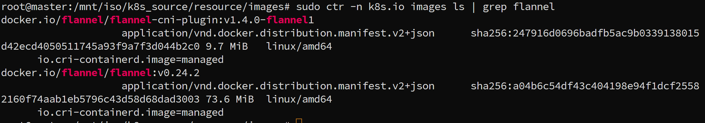
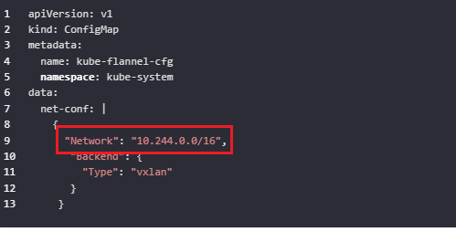

1. 先导入 flannel-0.24.2.tar 包

   

  sudo ctr -n k8s.io images import  flannel-0.24.2.tar

2. 列出flannel相关包版本

   sudo ctr -n k8s.io images ls | grep flannel 

3. 修改kube-flannel.yml文件

   - 修改版本

   - podcidr 地址

