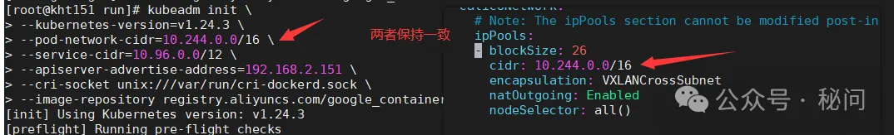
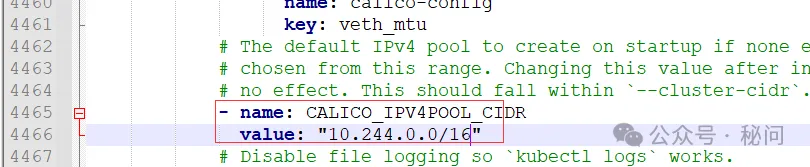
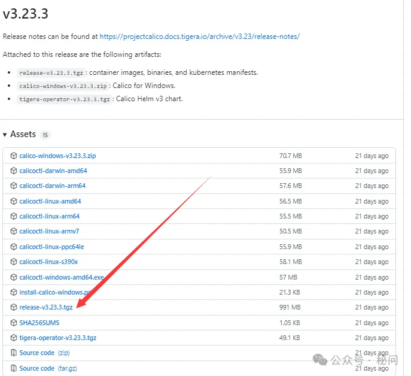
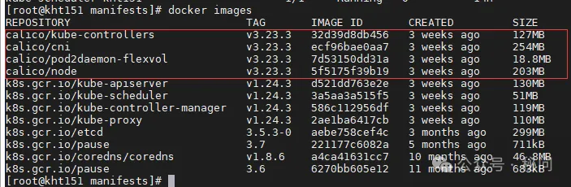

### calico网络插件安装

官网
版本匹配
可以参考的网址

#### 方法一

```
#下载operator资源清单文件
[root@k8s-master01 ~]# wget https://docs.projectcalico.org/manifests/tigera-operator.yaml
#应用资源清单文件，创建operator
[root@k8s-master01 ~]# kubectl apply -f tigera-operator.yaml
#3.通过自定义资源方式安装，下载配置 Calico 所需的自定义资源
curl https://projectcalico.docs.tigera.io/manifests/custom-resources.yaml -O
#修改custom-resources.yaml的ip如下图，创建清单以安装 Calico。
kubectl create -f custom-resources.yaml
[root@kht151 kht]# kubectl apply -f custom-resources.yaml
installation.operator.tigera.io/default created
apiserver.operator.tigera.io/default created
```



#### 方法二

```
#下载后修改IP如下图
curl https://projectcalico.docs.tigera.io/manifests/calico.yaml -O
curl -O https://docs.tigera.io/archive/v3.25/manifests/calico.yaml
#修改完成后执行
kubectl apply -f calico.yaml
```



### 安装时镜像拉取失败，配置镜像加速器

```
[root@localhost ~]# mkdir -p /etc/docker 
[root@localhost ~]# cat /etc/docker/daemon.json <<EOF
{
  "registry-mirrors": [
        "https://7mimmp7p.mirror.aliyuncs.com",
        "https://registry.docker-cn.com",
        "http://hub-mirror.c.163.com",
        "https://docker.mirrors.ustc.edu.cn"
        ],
  "exec-opts": ["native.cgroupdriver=systemd"],
  "log-driver": "json-file",
  "log-opts": {
    "max-size": "100m"
  },
  "storage-driver": "overlay2",
  "storage-opts": [
    "overlay2.override_kernel_check=true"
  ]
}
EOF
```

### 修改calico.yaml

由于默认的Calico清单文件中所使用的镜像来源于docker.io国外镜像源，上面我们配置了Docker镜像加速，应删除docker.io前缀以使镜像从国内镜像加速站点下载。

```
[root@kht151 kht]# cat calico.yaml |grep 'image:'
          image: docker.io/calico/cni:v3.23.3
          image: docker.io/calico/cni:v3.23.3
          image: docker.io/calico/node:v3.23.3
          image: docker.io/calico/node:v3.23.3
          image: docker.io/calico/kube-controllers:v3.23.3
[root@kht151 kht]# sed -i 's#docker.io/##g' calico.yaml
[root@kht151 kht]# cat calico.yaml |grep 'image:'
          image: calico/cni:v3.23.3
          image: calico/cni:v3.23.3
          image: calico/node:v3.23.3
          image: calico/node:v3.23.3
          image: calico/kube-controllers:v3.23.3
[root@kht151 kht]#
```

### 镜像拉取失败

下载网站

https://github.com/projectcalico/calico

##### 2、使用`ctr`命令导入镜像。

```shell
ctr image import app.tar  #导入本地镜像
ctr images list|grep app  #查看导入的镜像
crictl images list|grep app #此命令也可查看
```

下载完成后解压，image为docker镜像文件，还原



```
#查看k8s集群健康状态
[root@kht151 kht]# kubectl get cs
Warning: v1 ComponentStatus is deprecated in v1.19+
NAME                 STATUS    MESSAGE                         ERROR
scheduler            Healthy   ok
controller-manager   Healthy   ok
etcd-0               Healthy   {"health":"true","reason":""}
```