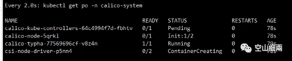
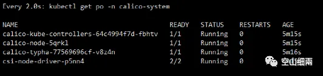
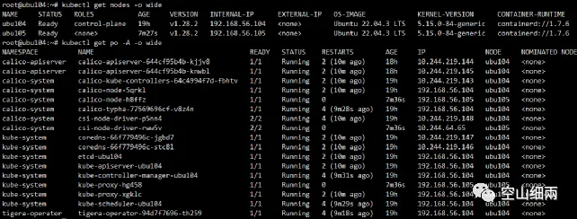
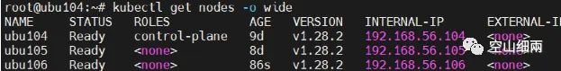

# 使用kubeadm/containerd/calico安装k8s

原创 wangjianme 

[空山细兩](javascript:void(0);)

 *2023年10月13日 21:43* *山东*

## 使用kubeadm/calico安装k8s 

规划： 一主一从k8s集群，系统：ubuntu22.04

| 节点/ip              | 角色         | 说明                                                   |
| -------------------- | ------------ | ------------------------------------------------------ |
| ubu104192.168.56.104 | masterworker | 主节点默认不可被调度，通过节点去污后，可以正常被调度。 |
| ubu105192.168.56.105 | worker       |                                                        |

​     

基于calico的安装时，需要先安装calico-operator，通过operator安装calico可以快速实现calico网络插件的安装。

### 1、准备工作 

直接执行以下脚本：

\#!/bin/bash

echo ">>>ubuntu 22.04 安装k8s前准备工作"

echo "----配置网络转发"

cat << EOF | tee /etc/modules-load.d/k8s.conf

overlay

br_netfilter

EOF

​     

echo "----网络转发生效"

modprobe overlay

modprobe br_netfilter

​     

echo "----查看网络转发"

lsmod | egrep "overlay"

lsmod | egrep "br_netfilter"

​     

echo "----添加网桥过虑内核转发配置文件"

cat << EOF | tee /etc/sysctl.d/k8s.conf

net.bridge.bridge-nf-call-ip6tables = 1

net.bridge.bridge-nf-call-iptables = 1

net.ipv4.ip_forward = 1

EOF

​     

echo "----加载内核参数"

sysctl --system

​     

​     

echo "----查看转发是否成功显示1为成功"

sysctl -a | grep io_forward

​     

echo "----安装ipset,ipvsadm"

apt install -y ipset ipvsadm

​     

echo "----配置ipvsadm模块加载"

cat << EOF | tee /etc/modules-load.d/ipvs.conf

ip_vs

ip_vs_rr

ip_vs_wrr

ip_vs_sh

nf_conntrack

EOF

​     

echo "----ipvsadm生效"

modprobe -- ip_vs

modprobe -- ip_vs_rr

modprobe -- ip_vs_wrr

modprobe -- ip_vs_sh

modprobe -- nf_conntrack

​     

echo "----关闭swap分区"

\# 请自行vim /etc/fstab 注释 swap行

swapoff -a

​     

echo "----中国时区"

timedatectl set-timezone Asia/Shanghai

​     

echo "----安装时间同步工具chrony"

apt install -y chrony

systemctl start chronyd

chronyc sources -v

​     

### 2、安装containerd 

在 github上下载，注意有 不同的版本

单机安装下载：containerd-1.7.6-linux-amd64.tar.gz

K8s中使用安装：cri-containerd-1.7.6-linux-amd64.tar.gz

下载：

wget https://github.com/containerd/containerd/releases/download/v1.7.6/cri-containerd-1.7.6-linux-amd64.tar.gz

​     

直接解压到根目录下，各文件会自动归位：

tar -zxvf cri-containerd-1.7.6-linux-amd64.tar.gz -C /

​     

查看：

root@ubu102:~# containerd --version

containerd github.com/containerd/containerd v1.7.6 091922f03c2762540fd057fba91260237ff86acb

root@ubu102:~# runc --version

runc version 1.1.9

commit: v1.1.9-0-gccaecfcb

spec: 1.0.2-dev

go: go1.20.8

libseccomp: 2.5.3

root@ubu102:~# crictl --version

crictl version 1.27.0

​     

### 3、**修改containerd配置** 

k8s 1.24之前，还支持cri-dockerd ；1.24以及之后版本不再支持了。所以必须安装CRI-O或者containerd作为container runtime。这里我选择了containerd。

containerd config default > /etc/containerd/config.toml

​     

生成containerd配置文件，然后/etc/containerd/config.toml中修改如下配置项：

 修改SystemdCgroup = true

 修改sandbox_image = ”registry.aliyuncs.com/google_containers/pause:3.9”

​     

### 4、启动containerd 

systemctl start containerd

​     

查看启动状态：

​     

设置为了开机自动启动：

systemctl enable containerd

​     

### 5、安装kubeadm,kubelet,kubectl 

配置aliyun的key:

curl -s https://mirrors.aliyun.com/kubernetes/apt/doc/apt-key.gpg | sudo apt-key add -

配置aliyun源：

cat </etc/apt/sources.list.d/kubernetes.list

deb https://mirrors.aliyun.com/kubernetes/apt/ kubernetes-xenial main

EOF

更新,不能出现错误即可：

apt update -y

​     

查看可用版本,如查看kubeadm的:

apt-cache madison kubeadm

更新：

apt-get update

安装：

apt-get install -y kubelet kubeadm kubectl

不更新，此软件版本 ：

apt-mark hold kubelet kubeadm kubectl

​     

也可以指定安装的版本：

apt-get install -y kubelet=1.28.2-00 kubeadm=1.28.2-00 kubectl=1.28.2-00

​     

### 6、生成kubeadm-config.yaml文件 

生成到用户当前目录下即可，如~/kubeadm-config.yaml,也可以生成到任意的目录下：

kubeadm config print init-defaults > kubeadm-config.yaml

编辑kubeadm-config.yaml文件，修改advertiseAddress和主机name，替换镜像仓库地址，增加podSubnet：

​     

​     

完整的文件如下：

apiVersion: kubeadm.k8s.io/v1beta3

bootstrapTokens:

\- groups:

 \- system:bootstrappers:kubeadm:default-node-token

 token: abcdef.0123456789abcdef

 ttl: 24h0m0s

 usages:

 \- signing

 \- authentication

kind: InitConfiguration

localAPIEndpoint:

 advertiseAddress: 192.168.56.102

 bindPort: 6443

nodeRegistration:

 criSocket: unix:///var/run/containerd/containerd.sock

 imagePullPolicy: IfNotPresent

 name: ubu102

 taints: null

\---

apiServer:

 timeoutForControlPlane: 4m0s

apiVersion: kubeadm.k8s.io/v1beta3

certificatesDir: /etc/kubernetes/pki

clusterName: kubernetes

controllerManager: {}

dns: {}

etcd:

 local:

  dataDir: /var/lib/etcd

\#imageRepository: registry.k8s.io

imageRepository: registry.aliyuncs.com/google_containers

kind: ClusterConfiguration

kubernetesVersion: 1.28.2

networking:

 dnsDomain: cluster.local

 serviceSubnet: 10.96.0.0/12

 podSubnet: 10.244.0.0/16

scheduler: {}

​     

### 7、下载镜像 

查看所需要的镜像：

root@ubu102:~# kubeadm config images list --config kubeadm-config.yaml

registry.aliyuncs.com/google_containers/kube-apiserver:v1.28.2

registry.aliyuncs.com/google_containers/kube-controller-manager:v1.28.2

registry.aliyuncs.com/google_containers/kube-scheduler:v1.28.2

registry.aliyuncs.com/google_containers/kube-proxy:v1.28.2

registry.aliyuncs.com/google_containers/pause:3.9

registry.aliyuncs.com/google_containers/etcd:3.5.9-0

registry.aliyuncs.com/google_containers/coredns:v1.10.1

下载镜像，这个过程会比较长，需要等待：

\# kubeadm config images pull --config kubeadm-config.yaml

[image Pulled] registry.aliyuncs.com/google_containers/kube-apiserver:v1.28.2

...

​     

### 8、初始化集群 

\# kubeadm init --config kubeadm-config.yaml

初始化成功以后，会显示 successful 标识，同时会显示加入集群的token 如：

kubeadm join 192.168.56.102:6443 --token abcdef.0123456789abcdef \

​    --discovery-token-ca-cert-hash sha256:37ad5087de85625b5f86dc79b50c3901b5b2a390364bed6119ddc614904c1f6e

​     

需要保存上面的token以便于后期加入集群使用。

### 9、查看集群状态 

 kubectl get nodes,此时还显示NotReady：

root@ubu102:~# kubectl get nodes

NAME   STATUS  ROLES      AGE  VERSION

ubu102  NotReady  control-plane  44m  v1.28.2

​     

查看pod,此时会有两个pod即dns的启动不成功：

root@ubu102:~# kubectl get po -A

NAMESPACE   NAME               READY  STATUS  RESTARTS   AGE

kube-system  coredns-66f779496c-f4s86     0/1   Init  2 (31m ago)  45m

kube-system  coredns-66f779496c-fnxvw     0/1   Init  2 (31m ago)  45m

kube-system  etcd-ubu102           1/1   Running  2 (31m ago)  45m

kube-system  kube-apiserver-ubu102      1/1   Running  2 (31m ago)  45m

kube-system  kube-controller-manager-ubu102  1/1   Running  2 (31m ago)  45m

kube-system  kube-proxy-k4lzj         1/1   Running  2 (31m ago)  45m

kube-system  kube-scheduler-ubu102      1/1   Running  2 (31m ago)  45m

​     

启动不成功的原因是没有网络插件.

### 10、安装calico 

先安装calico operator:

官网地址：

https://docs.tigera.io/calico/latest/getting-started/kubernetes/quickstart

​     

​     

#### 1、安装operator 

下载：

wget https://raw.githubusercontent.com/projectcalico/calico/v3.26.1/manifests/tigera-operator.yaml

创建此operator pod启动：

\#kubectl create -f tigera-operator.yaml

Namespace/trgera-operator created

Serviceaccount/tigera-operator created

...

deployment.apps/tigera-operator created

​     

查看：

查看ns会多出一个operator的命名空间：

root@ubu104:~# kubectl get ns

NAME       STATUS  AGE

tigera-operator  Active  43s

查看pod:

root@ubu104:~# kubectl get po -A

NAMESPACE     NAME               READY  STATUS  RESTARTS  AGE

tigera-operator  tigera-operator-94d7f7696-th259  1/1   Running  0     50s

​     

#### 2、安装calico 

下载：

 wget https://raw.githubusercontent.com/projectcalico/calico/v3.26.1/manifests/custom-resources.yaml

因为我们前面配置的podSubnet为10.244.0.0/16，所以需要做一个修改：

​     

创建：

\# kubectl create -f custom-resources.yaml

installation.operator.tigera.io/default created

apiserver.operator.tigera.io/default created

​     

查看创建过程：

watch kubectl get po -n calico-system

​     

根据您的网络速度，等待所有pod启动成功：

​     

最后，查看你的所有pod全部启动成功：

\# kubectl get po -A

Calico-apiserver ... running

### 11、主节点去污 

查看：

root@ubu104:~# kubectl describe node/ubu104 | grep Taints

Taints:       node-role.kubernetes.io/control-plane:NoSchedule

​     

如果显示：NoSchedule 表示此节点不能被调度，现在执行以下命令，删除此污点：

root@ubu104:~# kubectl taint node ubu104 node-role.kubernetes.io/control-plane-

node/ubu104 untainted

​     

查看：

root@ubu104:~# kubectl describe node/ubu104 | grep Taints

Taints:            

​     

### 12、测试 

#### 1、关机重新启 

测试通过。(出现kubelet启动不成功的问题，通过检查见附录2的1)

reboot

root@ubu104:/k8s/pods# kubectl get nodes

NAME   STATUS  ROLES      AGE  VERSION

ubu104  Ready  control-plane  13h  v1.28.2

#### 2、部署pod 

以下测试直接部署一个tomcat的pod：

apiVersion: v1

kind: Pod

metadata:

 name: tomcat

 namespace: dev

spec:

 nodeSelector:

  \# 由于kubectl create -f 命令只能在主节点的上执行，

  \# 所以可以指定此Pod创建到哪一台主机上,获取主机标签可以通过

  \# kubectl get nodes --show-labels 查看某个节点的所有标签

  \# kubernetes.io/hostname: ubu100

 containers:

 \- name: tomcat

  image: bitnami/tomcat:10.1.13

  ports:

   \- name: http

​    containerPort: 8080

​    protocol: TCP

​    \#直接暴露此host节点上的此端口就可以直接通过http://ip:8080访问成功 

​    hostPort: 8080    

  env:

   \- name: TZ

​    value: Asia/Shanghai

   \- name: TOMCAT_USER

​    value: tomcat

   \- name: TOMCAT_PASSWORD

​    value: tomcat123

  volumeMounts:

  \- name: workdir

   mountPath: /bitnami

 volumes:

 \- name: workdir

  hostPath:

   \# 目录授权：chown 1001:1001 -R /mnt/works/tomcat

   path: /opt/work/tomcat

   \# 目录不存在就创建,使用hostPath,注意声明目录权限

   type: DirectoryOrCreate

​     

创建目录：

mkdir /opt/work/tomcat -p

目录授权：

chown 1001:1001 -R /opt/work/tomcat

创建命名空间：

kubectl create ns dev

创建pod:

kubectl create -f pod-tomcat.yaml

查看：

root@ubu104:/k8s/pods# kubectl get po -n dev -o wide

NAME   READY  STATUS  RESTARTS  AGE  IP        NODE   NOMINATED NODE  READINESS GATES

tomcat  1/1   Running  0     33m  10.244.219.141  ubu104               

​     

#### 3、部署deployment+service示例 

kubectl create ns dev

​     

nginx-dep.yaml

apiVersion: apps/v1

kind: Deployment

metadata:

 namespace: dev

 name: nginx-deployment

spec:

 selector:

  matchLabels:

   app: nginx

 replicas: 1

 template:

  metadata:

   labels:

​    app: nginx

  spec:

   containers:

   \- name: nginx

​    image: nginx:alpine

​    ports:

​    \- containerPort: 80

​     

nginx-service.yaml

apiVersion: v1

kind: Service

metadata:

 namespace: dev

 name: nginx-service

spec:

 selector:

  app: nginx

 type: NodePort

 ports:

 \- protocol: TCP

  port: 80

  targetPort: 80

  nodePort: 30001

​     

kubectl create -f nginx-dep.yaml

kubectl create -f nginx-service.yaml

​     

访问，返回nginx主页即成功：

curl 192.168.56.104:30001

访问成功。

到此，单机节点的基于calico网络的k8s部署完成。

​     

### 13、加入从节点 

如在192.168.56.105主机上执行kubeadm join命令：

将之前备份的Token copy出来，执行如下：

\# kubeadm join 192.168.56.104:6443 --token abcdef.0123456789abcdef \

​    --discovery-token-ca-cert-hash sha256:93f3835b3b3d2761fdb5392bb387cca17b49b0c2e4957fab671a8a49310e2863

​     

​     

然后等待，所有主机的pod初始化成功：

执行：

kubectl get nodes -o wide

kubectl get po -A -o wide

​     

到此，一个1主一从的k8s集群，就算是创建完成了。

### 14、关机重新启动测试集群是否可以启动成功 

（2023-10-6 AM）

一主一从，两台主机，都机后，重新启动，检查nodes节点状态正常：

检查所有pod都启动正常：

### 15、在集群上部署一个deployment 

部署一个nginx的deployment测试:

文件名：nginx-dep.yaml:

apiVersion: apps/v1

kind: Deployment

metadata:

 namespace: dev

 name: nginx-deployment

spec:

 selector:

  matchLabels:

   app: nginx

 replicas: 2

 template:

  metadata:

   labels:

​    app: nginx

  spec:

   containers:

   \- name: nginx

​    image: nginx:alpine

​    ports:

​    \- containerPort: 80

​     

\# kubectl create -f nginx-dep.yaml

​     

部署服务暴露端口:

文件名，nginx-service.yaml，以下使用的是NodePort。

apiVersion: v1

kind: Service

metadata:

 namespace: dev

 name: nginx-service

spec:

 selector:

  app: nginx

 type: NodePort

 ports:

 \- protocol: TCP

  port: 80

  targetPort: 80

  nodePort: 30001

​     

Kubectl create -f nginx-service.yaml.

​     

查看：

访问：(由是一个一主三从的k8s集群，所以，这儿使用任意一个ip都可以访问到)

curl 192.168.56.104:30001

curl 192.168.56.105:30001

curl     192.168.56.106:30001

以上三个地址都访问成功。

​     

​     

​     

### 16、k8s集群节点操作 

#### 1、添加一个新的node节点： 

生成一个没有过期时间的token:

\# kubeadm token create --ttl 0 --print-join-command

kubeadm join 192.168.56.104:6443

--token fhyf25.hwku3jibhqd1kjbk

--discovery-token-ca-cert-hash sha256:93f3835b3b3d2761fdb5392bb387cca17b49b0c2e4957fab671a8a49310e2863

​     

显示列表：

​     

在一台新的主机上，安装好kubelet,kubeadm

启动containerd（最好设置了开机自启动)

然后执行：

kubeadm join 192.168.56.104:6443 --token fhyf25.hwku3jibhqd1kjbk --discovery-token-ca-cert-hash sha256:93f3835b3b3d2761fdb5392bb387cca17b49b0c2e4957fab671a8a49310e2863

​     

查看并等待成功：      

​     

以下是所有Pod都启动成功以后的状态：

到此，一个一主三从的k8s集群，就算是创建成功了。

​     

#### 2、删除一个node 

参考：https://blog.csdn.net/qq_42997214/article/details/122664945

​     

Mark node "xxx" as unschedulable

\# kubectl cordon ubu106

node/ubu106 cordoned

​     

查看状态：

​     

​     

迁移此node上的pod:

kubectl drain ubu106 --delete-local-data --ignore-daemonsets --force

​     

执行删除：

\# kubectl delete nodes ubu106

node "ubu106" deleted

最后查看，已经没有被删除的节点了：

root@ubu104:/k8s/deployment# kubectl get nodes

NAME   STATUS  ROLES      AGE  VERSION

ubu104  Ready  control-plane  9d  v1.28.2

ubu105  Ready            8d  v1.28.2

​     

最后，在被删除的节点上，执行：

kubeadm reset

 

到此已经完成删除功能。

可以再次通过 kubeadm join 重新加入集群：

kubeadm join 192.168.56.104:6443 \

--token fhyf25.hwku3jibhqd1kjbk --discovery-token-ca-cert-hash sha256:93f3835b3b3d2761fdb5392bb387cca17b49b0c2e4957fab671a8a49310e2863

加入后，再次查看：

#### 3、提升一个node为master 

//TODO: 保留后期实现。

​     

### 17、使用kuboard图形化界面 

请直接参考1.3.15节。

此节：

1：开启一台独立的主机。

2：安装独立的docker-ce。

3：启动kuboard。

4：生成token并添加到现有k8s集群中即可。

​     

#### 1、在一台独立的主机上部署kuboard 

创建目录卷用于保存数据：

mkdir ./data

启动脚本：

\#!/bin/bash

sudo docker run -d \

 --restart=unless-stopped \

 --name=kuboard \

 -p 80:80/tcp \

 -p 10081:10081/tcp \

 -e KUBOARD_ENDPOINT="http://192.168.56.101:80" \

 -e KUBOARD_AGENT_SERVER_TCP_PORT="10081" \

 -v ${PWD}/data:/data \

 eipwork/kuboard:v3.5.2.6

 \# 也可以使用镜像 swr.cn-east-2.myhuaweicloud.com/kuboard/kuboard:v3 ，可以更快地完成镜像下载。

 \# 请不要使用 127.0.0.1 或者 localhost 作为内网 IP \

 \# Kuboard 不需要和 K8S 在同一个网段，Kuboard Agent 甚至可以通过代理访问 Kuboard Server \

​     

\# docker ps

CONTAINER ID  IMAGE           COMMAND      CREATED     STATUS     PORTS                                            NAMES

3016ddf1bdf0  eipwork/kuboard:v3.5.2.6  "/entrypoint.sh"  33 minutes ago  Up 30 minutes

​     

#### 2、访问 

http://192.168.56.101/kuboard/cluster

用户名：admin

密码：Kuboard123

​     

​     

#### 3、添加现有k8s集群 

根据提示，生成Token：

​     

​     

以下是生成的token,也可以重复是使用命令生成：

​     

获取token的命令为：

echo -e "\033[31m$(kubectl -n kuboard get secret $(kubectl -n kuboard get secret kuboard-admin-token | grep kuboard-admin-token | awk '{print $1}') -o go-template='{{.data.token}}' | base64 -d)\033[0m"

​     

​     

查看界面：

​     