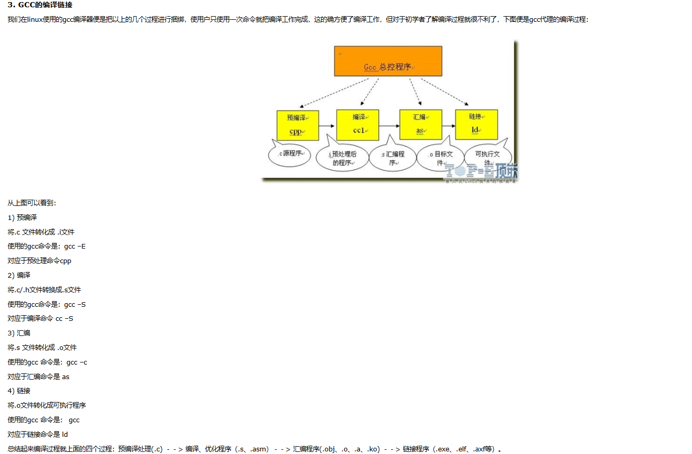

[TOC]
## 内存管理

[技术干货 | 理解 Go 内存分配-腾讯云开发者社区-腾讯云 (tencent.com)](https://cloud.tencent.com/developer/article/1861429)

[Go栈内存、堆内存、逃逸分析 - 知乎 (zhihu.com)](https://zhuanlan.zhihu.com/p/515832798)

### 堆栈

- Go 语言有两部分内存空间：栈内存和堆内存

#### OS的堆栈

- 栈是一种后进先出的结构，计算机中有一块满足该特性的动态内存区域，程序可以将数据压入栈中或者将数据从栈中弹出。

- 堆也是计算机中的一种内存区域，堆与栈的区别：

  1. 栈一般由操作系统来分配和释放，堆由程序员通过编程语言来申请创建与释放。 

  2. 栈用来存放 **函数的参数、返回值、局部变量、函数调用、函数调用时的临时上下文等**，堆用来存放全局变量。
     - 局部的，占用空间确定的数据，一般放在栈中，否则放入堆中。
  3. 栈的访问速度相对比堆快。
  4. 每个线程分配一个stack, 每个进程分配一个堆，stack是线程独占的，堆是线程共享的。
  5. **stack** 创建的时候，大小是确定的，数据超过这个大小，就发生stack overflow 错误，而**heap**的大小是不确定的，需要的话可以不断增加。
  6. **栈**是由高地址向低地址增长的，而**堆**是由低地址向高地址增长的。

#### go的堆栈

- Go 等语言中，提供了一种自动释放的内存空间的功能，这就是垃圾回收机制。
- Go是自己管理内存的，而不是交给操作系统，它每次从操作系统申请一大块内存，然后按照Goole的 `TCMalloc`算法进行内存分配，也划分为堆、栈等区域。
- **栈内存由编译器自动分配和释放，开发者无法控制。栈内存一般存储函数中的局部变量、参数等，函数创建的时候，这些内存会被自动创建；函数返回的时候，这些内存会被自动释放。**
- **栈可用于内存分配，栈的分配和回收速度非常快。**

### 内存逃逸

- 逃逸： 分配在堆还是栈完全**由编译器确定**，而原本看起来应该分配在栈上的变量，如果其生命周期获得了延长，被分配在了堆上，就说它发生了**逃逸**（编译器操作的）。

#### 逃逸分析

- 编译器会自动地去判断变量的生命周期是否获得了延长，整个判断的过程就叫**逃逸分析**。
- 逃逸分析是编译器用于决定变量分配到堆上还是栈上的一种行为。

#### 逃逸时机

- Go语言是在编译阶段确定逃逸，并不是在运行时。

#### 为什么需要逃逸

- 垃圾回收GC 的压力不断增大
- 申请，分配，回收内存的系统开销增大（相对于栈）
- 动态分配产生一定量的内存碎片

**频繁申请、分配堆内存是有一定 “代价” 的。会影响应用程序运行的效率，间接影响到整体系统。因此 “按需分配” 最大限度的灵活利用资源，才是正确的治理之道，这就是为什么需要逃逸分析的原因之一。**

#### 逃逸机制

- **逃逸机制**： 编译器会根据变量**是否被外部引用**来决定是否逃逸：
  1. 如果函数外部没有引用，则优先放到栈中
  2. 如果函数外部存在引用，则必定放到堆中
  3. 如果栈上放不下，则必定放到堆中

- 变量发生逃逸的情况可以总结如下：

  1. 指针逃逸：函数返回值为局部变量的指针，虽然函数退出了，但是因为指针的存在，指向的内存不能随着函数结束而回收，因此只能分配在堆上。

     **指针作为函数返回值的时候，一定会发生逃逸**。

  2. 栈空间不足：一个栈的默认大小是 2K，它会自动扩容，最大值取决于系统的配置。当栈空间足够时，不会发生逃逸，但是当变量过大时，已经完全超过栈空间的大小时，将会发生逃逸到堆上分配内存。例如：s := make([]int, 10000, 10000)，此时 s 就会因为太大被分配到堆上。

  3. 变量大小不确定：例如：number = 10; s := make([]int, number)，此时由于编译期间无法确定slice大长度，所以会被分配到堆上，如果直接写成: s := make([]int, 10)，则不会发生逃逸。

  4. 动态类型：就是在编译期间不能确定参数的类型，参数的长度，此时就是发生逃逸。比如空接口interface{}可以表示任意类型，如果函数入参为interface{}，编译期间无法确定其参数的具体类型，就会发生逃逸。例如： fmt.Println() 的参数类型为 interface{}，因此会导致打印的对象逃逸到堆上。

  5. 闭包引用对象：当闭包函数访问了外部变量 n，变量 n 占用的内存不能随着闭包函数的退出而回收，变量 n 将会一直存在，直到被GC回收。

  6. 发送指针或带有指针的值到 channel 中。 在编译时，是没有办法知道哪个 goroutine 会在 channel 上接收数据。所以编译器没法知道变量什么时候才会被释放。

  7. 在一个切片上存储指针或带指针的值。 一个典型的例子就是 []*string 。这会导致切片的内容逃逸。尽管其后面的数组可能是在栈上分配的，但其引用的值一定是在堆上。

  8. slice 的背后数组被重新分配了，因为 append 时可能会超出其容量( cap )。 slice 初始化的地方在编译时是可以知道的，它最开始会在栈上分配。如果切片背后的存储要基于运行时的数据进行扩充，就会在堆上分配。


#### 如何确定是否逃逸

- 1. 可以通过编译器提供的指令 `- gcflags`

     ```
     $ go build -gcflags '-m -l' main.go
     ```

     - `-m`： 打印出逃逸分析的优化策略，实际上最多总共可以用4个`-m`
     - `-l`:   禁用函数内联，在这里禁用inline能更好的观察逃逸情况，减少干扰。

- 2. 通过反编译命令查看

     ```
     go tool compile -S main.go
     ```

### 优化技巧

- 尽可能避免逃逸，因为栈内存效率更高，还不用GC。比如小对象的传参尽量不使用指针，能用数组就不要用切片
- 如果避免不了逃逸，还是在堆上分配了内存，那么对于频繁的内存申请操作，要学会重用内存，比如使用sync.Pool操作
- 选用合适算法，达到高性能的目的，比如空间换时间。
- **小提示：性能优化的时候，要结合基准测试，来验证自己的优化是否有提升。**
- **要尽可能避免使用锁、并发加锁的范围要尽可能小、使用 StringBuilder 做 string 和 []byte 之间的转换、defer 嵌套不要太多**等等。

## 编译过程




